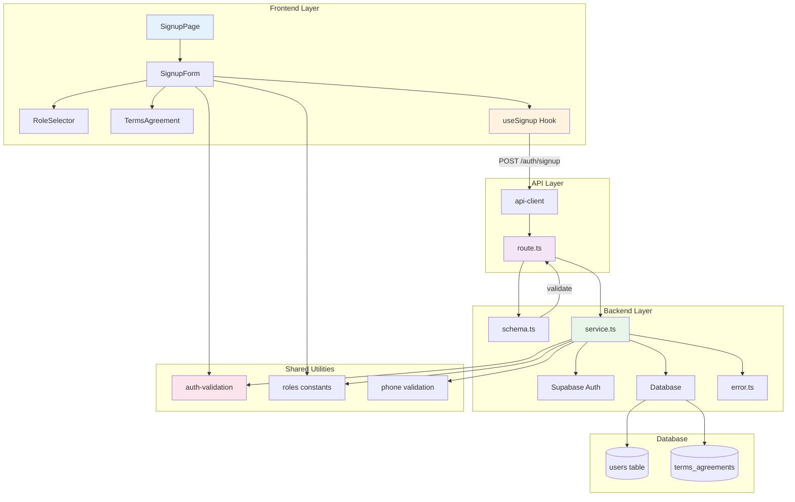

# UC-001: 회원가입 & 역할선택 - 구현 계획

## 개요

### 백엔드 모듈

| 모듈 | 위치 | 설명 |
|------|------|------|
| **schema.ts** | `src/features/signup/backend/schema.ts` | Zod 스키마 정의 (회원가입 요청/응답) |
| **service.ts** | `src/features/signup/backend/service.ts` | 회원가입 비즈니스 로직 (Supabase Auth + DB 저장) |
| **error.ts** | `src/features/signup/backend/error.ts` | 회원가입 관련 에러 코드 정의 |
| **route.ts** | `src/features/signup/backend/route.ts` | Hono 라우터 (POST /auth/signup) |
| **dto.ts** | `src/features/signup/lib/dto.ts` | 클라이언트용 DTO 재노출 |

### 프론트엔드 모듈

| 모듈 | 위치 | 설명 |
|------|------|------|
| **SignupPage** | `src/app/signup/page.tsx` | 회원가입 페이지 (기존 수정) |
| **SignupForm** | `src/features/signup/components/SignupForm.tsx` | 회원가입 폼 컴포넌트 |
| **RoleSelector** | `src/features/signup/components/RoleSelector.tsx` | 역할 선택 컴포넌트 |
| **TermsAgreement** | `src/features/signup/components/TermsAgreement.tsx` | 약관 동의 컴포넌트 |
| **useSignup** | `src/features/signup/hooks/useSignup.ts` | React Query 훅 |
| **terms.ts** | `src/features/signup/constants/terms.ts` | 약관 버전 및 내용 |

### 공통 모듈

| 모듈 | 위치 | 설명 |
|------|------|------|
| **auth-validation.ts** | `src/lib/validation/auth.ts` | 공통 validation 함수 |
| **roles.ts** | `src/constants/roles.ts` | 역할 상수 (USER_ROLE enum) |
| **phone.ts** | `src/lib/validation/phone.ts` | 휴대폰번호 검증 및 포맷팅 |

### 수정 파일

| 파일 | 위치 | 변경 사항 |
|------|------|----------|
| **app.ts** | `src/backend/hono/app.ts` | registerSignupRoutes 추가 |

---

## Diagram



---

## Implementation Plan

### 1️⃣ Backend Layer

#### 1.1 Schema Definition (`src/features/signup/backend/schema.ts`)

**목적**: 회원가입 요청/응답 데이터 구조 정의

**구현 내용**:
```typescript
// Request Schema
- SignupRequestSchema
  - name: string (1-100자)
  - email: string (이메일 형식)
  - phone: string (휴대폰 형식)
  - password: string (8-100자, 영문/숫자 포함)
  - role: 'influencer' | 'advertiser'
  - terms: { required: boolean, marketing: boolean }

// Response Schema  
- SignupResponseSchema
  - userId: string (UUID)
  - email: string
  - role: string
  - emailVerificationSent: boolean

// DB Row Schema
- UserTableRowSchema (users 테이블)
- TermsAgreementRowSchema (terms_agreements 테이블)
```

**Unit Tests**:
```typescript
describe('SignupRequestSchema', () => {
  it('유효한 요청 데이터를 통과시킨다', () => {
    // Given: 올바른 회원가입 데이터
    // When: schema.parse() 호출
    // Then: 에러 없이 통과
  });

  it('이메일 형식이 잘못되면 실패한다', () => {
    // Given: 잘못된 이메일 형식
    // When: schema.safeParse() 호출
    // Then: success: false, 에러 메시지 확인
  });

  it('비밀번호가 8자 미만이면 실패한다', () => {});
  it('필수 약관 미동의 시 실패한다', () => {});
  it('역할이 enum 외 값이면 실패한다', () => {});
});
```

---

#### 1.2 Service Layer (`src/features/signup/backend/service.ts`)

**목적**: 회원가입 비즈니스 로직 구현

**구현 내용**:
```typescript
// Main Function
export const signupUser = async (
  client: SupabaseClient,
  data: SignupRequest
): Promise<HandlerResult<SignupResponse, SignupServiceError>>

// 처리 단계:
1. Supabase Auth 계정 생성 (auth.signUp)
2. users 테이블에 프로필 저장
3. terms_agreements 테이블에 약관 동의 저장
4. 트랜잭션 처리 (실패 시 롤백)
5. 이메일 검증 메일 발송 확인

// Helper Functions
- createAuthUser()
- saveUserProfile()
- saveTermsAgreement()
- handleSignupError()
```

**Unit Tests**:
```typescript
describe('signupUser', () => {
  it('정상 회원가입 시 성공 응답을 반환한다', async () => {
    // Given: Mock Supabase client, 유효한 데이터
    // When: signupUser() 호출
    // Then: ok: true, userId 존재, role 일치
  });

  it('중복 이메일 시 409 에러를 반환한다', async () => {
    // Given: 이미 존재하는 이메일
    // When: signupUser() 호출
    // Then: status 409, error.code === 'EMAIL_ALREADY_EXISTS'
  });

  it('Auth 생성 실패 시 적절한 에러를 반환한다', async () => {
    // Given: Auth 생성 실패하는 Mock
    // When: signupUser() 호출
    // Then: status 500, error.code === 'AUTH_CREATION_FAILED'
  });

  it('DB 저장 실패 시 롤백한다', async () => {
    // Given: Auth 성공, DB 저장 실패
    // When: signupUser() 호출
    // Then: Auth 계정도 삭제 시도 (정리)
  });

  it('약관 동의 이력을 정확히 저장한다', async () => {
    // Given: 유효한 데이터
    // When: signupUser() 호출
    // Then: terms_agreements 테이블에 올바른 데이터 저장
  });
});
```

---

#### 1.3 Error Codes (`src/features/signup/backend/error.ts`)

**목적**: 회원가입 관련 에러 코드 정의

**구현 내용**:
```typescript
export const signupErrorCodes = {
  invalidRequest: 'INVALID_SIGNUP_REQUEST',
  emailAlreadyExists: 'EMAIL_ALREADY_EXISTS',
  phoneAlreadyExists: 'PHONE_ALREADY_EXISTS',
  authCreationFailed: 'AUTH_CREATION_FAILED',
  profileCreationFailed: 'PROFILE_CREATION_FAILED',
  termsAgreementFailed: 'TERMS_AGREEMENT_FAILED',
  validationError: 'VALIDATION_ERROR',
  rateLimitExceeded: 'RATE_LIMIT_EXCEEDED',
} as const;

export type SignupServiceError = typeof signupErrorCodes[keyof typeof signupErrorCodes];
```

---

#### 1.4 Route Handler (`src/features/signup/backend/route.ts`)

**목적**: HTTP 엔드포인트 정의

**구현 내용**:
```typescript
export const registerSignupRoutes = (app: Hono<AppEnv>) => {
  app.post('/auth/signup', async (c) => {
    // 1. Request body 파싱
    const body = await c.req.json();
    
    // 2. Schema 검증
    const parsed = SignupRequestSchema.safeParse(body);
    if (!parsed.success) {
      return respond(c, failure(400, ...));
    }
    
    // 3. Service 호출
    const supabase = getSupabase(c);
    const result = await signupUser(supabase, parsed.data);
    
    // 4. 에러 처리 및 로깅
    if (!result.ok) {
      const logger = getLogger(c);
      logger.error('Signup failed', result.error);
    }
    
    // 5. 응답
    return respond(c, result);
  });
};
```

**Unit Tests**:
```typescript
describe('POST /auth/signup', () => {
  it('유효한 요청 시 201을 반환한다', async () => {
    // Given: 유효한 회원가입 데이터
    // When: POST /auth/signup
    // Then: status 201, body에 userId 포함
  });

  it('잘못된 요청 시 400을 반환한다', async () => {
    // Given: 스키마에 맞지 않는 데이터
    // When: POST /auth/signup
    // Then: status 400, error.code === 'INVALID_SIGNUP_REQUEST'
  });

  it('중복 이메일 시 409를 반환한다', async () => {});
  it('서버 오류 시 500을 반환한다', async () => {});
});
```

---

#### 1.5 DTO Export (`src/features/signup/lib/dto.ts`)

**목적**: 프론트엔드에서 사용할 타입 재노출

**구현 내용**:
```typescript
export {
  SignupRequestSchema,
  SignupResponseSchema,
  type SignupRequest,
  type SignupResponse,
} from '@/features/signup/backend/schema';
```

---

### 2️⃣ Frontend Layer

#### 2.1 Signup Hook (`src/features/signup/hooks/useSignup.ts`)

**목적**: 회원가입 API 호출 로직 캡슐화

**구현 내용**:
```typescript
export const useSignup = () => {
  const router = useRouter();
  const { refresh } = useCurrentUser();

  return useMutation({
    mutationFn: async (data: SignupRequest) => {
      const response = await apiClient.post('/auth/signup', data);
      return SignupResponseSchema.parse(response.data);
    },
    onSuccess: async (data) => {
      await refresh();
      
      // 역할에 따라 리다이렉트
      if (data.role === 'influencer') {
        router.push('/onboarding/influencer');
      } else {
        router.push('/onboarding/advertiser');
      }
    },
    onError: (error) => {
      // 에러 처리
    },
  });
};
```

**QA Sheet**:
```typescript
// UI 동작 검증
✓ 제출 중 버튼 비활성화 및 로딩 표시
✓ 성공 시 적절한 페이지로 리다이렉트
✓ 에러 시 에러 메시지 표시
✓ 네트워크 오류 처리

// 데이터 검증
✓ 요청 데이터가 스키마와 일치
✓ 응답 데이터 파싱 성공
✓ 역할별 다른 리다이렉트 경로
```

---

#### 2.2 Signup Form Component (`src/features/signup/components/SignupForm.tsx`)

**목적**: 회원가입 폼 UI 및 상태 관리

**구현 내용**:
```typescript
export const SignupForm = () => {
  // react-hook-form 사용
  const form = useForm<SignupRequest>({
    resolver: zodResolver(SignupRequestSchema),
    defaultValues: { ... },
  });

  const signupMutation = useSignup();

  const onSubmit = (data: SignupRequest) => {
    signupMutation.mutate(data);
  };

  return (
    <Form {...form}>
      {/* Input fields */}
      - 이름
      - 이메일
      - 휴대폰번호 (포맷팅 적용)
      - 비밀번호
      - 비밀번호 확인
      - 역할 선택 (RoleSelector)
      - 약관 동의 (TermsAgreement)
      
      {/* Submit button */}
    </Form>
  );
};
```

**QA Sheet**:
```yaml
# 입력 검증
- [ ] 이름 1-100자 제한
- [ ] 이메일 형식 실시간 검증
- [ ] 휴대폰번호 자동 포맷팅 (010-1234-5678)
- [ ] 비밀번호 8자 이상, 영문/숫자 포함
- [ ] 비밀번호 확인 일치 여부
- [ ] 필수 약관 미동의 시 제출 불가

# UI/UX
- [ ] 각 필드별 에러 메시지 표시
- [ ] 포커스 시 테두리 색상 변경
- [ ] 제출 중 로딩 표시
- [ ] 성공/실패 토스트 메시지
- [ ] 반응형 레이아웃 (모바일/태블릿/PC)

# 접근성
- [ ] label과 input 연결
- [ ] 키보드 네비게이션 가능
- [ ] 에러 메시지 스크린리더 읽기
- [ ] 버튼 disabled 상태 명확
```

---

#### 2.3 Role Selector Component (`src/features/signup/components/RoleSelector.tsx`)

**목적**: 역할 선택 UI

**구현 내용**:
```typescript
export const RoleSelector = ({ value, onChange }: Props) => {
  return (
    <div className="grid grid-cols-2 gap-4">
      <RoleCard
        role="influencer"
        selected={value === 'influencer'}
        onClick={() => onChange('influencer')}
        icon={<Users />}
        title="인플루언서"
        description="SNS 채널을 운영하고 체험단에 참여합니다"
      />
      <RoleCard
        role="advertiser"
        selected={value === 'advertiser'}
        onClick={() => onChange('advertiser')}
        icon={<Store />}
        title="광고주"
        description="체험단을 등록하고 관리합니다"
      />
    </div>
  );
};
```

**QA Sheet**:
```yaml
# 동작
- [ ] 클릭 시 선택 상태 변경
- [ ] 하나만 선택 가능 (라디오 버튼 동작)
- [ ] 선택 상태 시각적으로 명확 (배경색, 테두리)
- [ ] 아이콘과 설명 명확히 표시

# 접근성
- [ ] 키보드로 선택 가능 (Tab, Enter)
- [ ] 선택 상태 aria-selected
- [ ] role="radiogroup"
```

---

#### 2.4 Terms Agreement Component (`src/features/signup/components/TermsAgreement.tsx`)

**목적**: 약관 동의 UI

**구현 내용**:
```typescript
export const TermsAgreement = ({ value, onChange }: Props) => {
  return (
    <div className="space-y-3">
      <Checkbox
        checked={value.required}
        onCheckedChange={(checked) => 
          onChange({ ...value, required: checked })
        }
        required
      >
        <span className="font-medium">[필수]</span> 서비스 이용약관 동의
        <Button variant="link" size="sm">보기</Button>
      </Checkbox>

      <Checkbox
        checked={value.marketing}
        onCheckedChange={(checked) => 
          onChange({ ...value, marketing: checked })
        }
      >
        <span className="text-muted-foreground">[선택]</span> 마케팅 정보 수신 동의
        <Button variant="link" size="sm">보기</Button>
      </Checkbox>
    </div>
  );
};
```

**QA Sheet**:
```yaml
# 동작
- [ ] 필수 약관 미동의 시 제출 불가
- [ ] 선택 약관은 선택 가능
- [ ] "보기" 클릭 시 약관 모달 표시
- [ ] 체크박스 상태 동기화

# UI/UX
- [ ] 필수/선택 구분 명확
- [ ] 약관 텍스트 읽기 쉽게 포맷
- [ ] 모달에서 전문 표시

# 접근성
- [ ] 체크박스 키보드 조작
- [ ] label 클릭 시 체크박스 토글
```

---

#### 2.5 Terms Constants (`src/features/signup/constants/terms.ts`)

**목적**: 약관 버전 및 텍스트 관리

**구현 내용**:
```typescript
export const TERMS_VERSION = 'v1.0.0';

export const REQUIRED_TERMS = {
  version: TERMS_VERSION,
  title: '서비스 이용약관',
  content: `...약관 전문...`,
};

export const MARKETING_TERMS = {
  title: '마케팅 정보 수신 동의',
  content: `...약관 전문...`,
};
```

---

#### 2.6 Signup Page Update (`src/app/signup/page.tsx`)

**목적**: 기존 페이지를 새 SignupForm으로 교체

**구현 내용**:
```typescript
export default function SignupPage({ params }: SignupPageProps) {
  void params;
  const { isAuthenticated } = useCurrentUser();
  const router = useRouter();

  useEffect(() => {
    if (isAuthenticated) {
      router.replace('/');
    }
  }, [isAuthenticated, router]);

  if (isAuthenticated) {
    return null;
  }

  return (
    <div className="container">
      <header>
        <h1>회원가입</h1>
        <p>블로그 체험단 플랫폼에 오신 것을 환영합니다</p>
      </header>

      <SignupForm />

      <footer>
        <p>
          이미 계정이 있으신가요?{' '}
          <Link href="/login">로그인</Link>
        </p>
      </footer>
    </div>
  );
}
```

**QA Sheet**:
```yaml
# 라우팅
- [ ] 로그인 상태면 자동 리다이렉트
- [ ] 회원가입 성공 시 역할별 온보딩 페이지로 이동
- [ ] 로그인 링크 동작

# 레이아웃
- [ ] 헤더, 폼, 푸터 적절한 간격
- [ ] 모바일 반응형
- [ ] 중앙 정렬
```

---

### 3️⃣ Shared Utilities

#### 3.1 Auth Validation (`src/lib/validation/auth.ts`)

**목적**: 공통 validation 로직

**구현 내용**:
```typescript
export const validateEmail = (email: string): boolean => {
  const emailRegex = /^[^\s@]+@[^\s@]+\.[^\s@]+$/;
  return emailRegex.test(email);
};

export const validatePassword = (password: string): {
  valid: boolean;
  errors: string[];
} => {
  const errors: string[] = [];
  
  if (password.length < 8) {
    errors.push('8자 이상 입력해주세요');
  }
  if (!/[a-zA-Z]/.test(password)) {
    errors.push('영문을 포함해주세요');
  }
  if (!/[0-9]/.test(password)) {
    errors.push('숫자를 포함해주세요');
  }
  
  return {
    valid: errors.length === 0,
    errors,
  };
};

export const sanitizeName = (name: string): string => {
  return name.trim().substring(0, 100);
};
```

**Unit Tests**:
```typescript
describe('validateEmail', () => {
  it('유효한 이메일은 true를 반환한다', () => {});
  it('잘못된 형식은 false를 반환한다', () => {});
});

describe('validatePassword', () => {
  it('8자 이상, 영문/숫자 포함 시 valid: true', () => {});
  it('조건 미달 시 적절한 에러 메시지를 반환한다', () => {});
});
```

---

#### 3.2 Phone Validation (`src/lib/validation/phone.ts`)

**목적**: 휴대폰번호 검증 및 포맷팅

**구현 내용**:
```typescript
export const formatPhoneNumber = (phone: string): string => {
  // 숫자만 추출
  const numbers = phone.replace(/\D/g, '');
  
  // 010-1234-5678 포맷
  if (numbers.length === 11) {
    return numbers.replace(/(\d{3})(\d{4})(\d{4})/, '$1-$2-$3');
  }
  
  return phone;
};

export const validatePhoneNumber = (phone: string): boolean => {
  const phoneRegex = /^010-\d{4}-\d{4}$/;
  return phoneRegex.test(phone);
};

export const normalizePhoneNumber = (phone: string): string => {
  // 하이픈 제거
  return phone.replace(/-/g, '');
};
```

**Unit Tests**:
```typescript
describe('formatPhoneNumber', () => {
  it('11자리 숫자를 010-1234-5678 형식으로 변환한다', () => {});
  it('이미 포맷된 번호는 그대로 반환한다', () => {});
});

describe('validatePhoneNumber', () => {
  it('올바른 형식은 true를 반환한다', () => {});
  it('잘못된 형식은 false를 반환한다', () => {});
});
```

---

#### 3.3 Roles Constants (`src/constants/roles.ts`)

**목적**: 역할 관련 상수 정의

**구현 내용**:
```typescript
export const USER_ROLE = {
  INFLUENCER: 'influencer',
  ADVERTISER: 'advertiser',
} as const;

export type UserRole = typeof USER_ROLE[keyof typeof USER_ROLE];

export const ROLE_LABELS: Record<UserRole, string> = {
  [USER_ROLE.INFLUENCER]: '인플루언서',
  [USER_ROLE.ADVERTISER]: '광고주',
};

export const ROLE_DESCRIPTIONS: Record<UserRole, string> = {
  [USER_ROLE.INFLUENCER]: 'SNS 채널을 운영하고 체험단에 참여합니다',
  [USER_ROLE.ADVERTISER]: '체험단을 등록하고 관리합니다',
};
```

---

### 4️⃣ Integration

#### 4.1 Hono App Registration (`src/backend/hono/app.ts`)

**수정 내용**:
```typescript
import { registerSignupRoutes } from '@/features/signup/backend/route';

export const createHonoApp = () => {
  // ... 기존 코드 ...
  
  registerExampleRoutes(app);
  registerSignupRoutes(app); // 추가
  
  singletonApp = app;
  return app;
};
```

---

## 구현 순서

### Phase 1: 기반 작업
1. ✅ 공통 유틸리티 작성 (validation, roles)
2. ✅ 백엔드 스키마 정의
3. ✅ 에러 코드 정의

### Phase 2: 백엔드 구현
4. ✅ Service 레이어 구현 및 테스트
5. ✅ Route 레이어 구현 및 테스트
6. ✅ Hono 앱에 라우터 등록

### Phase 3: 프론트엔드 구현
7. ✅ DTO 재노출 및 Hook 구현
8. ✅ UI 컴포넌트 작성 (RoleSelector, TermsAgreement)
9. ✅ SignupForm 통합
10. ✅ Signup 페이지 업데이트

### Phase 4: 통합 테스트
11. ✅ E2E 시나리오 테스트
12. ✅ Edge Case 검증
13. ✅ UX 검증 (QA Sheet)

---

## 테스트 전략

### Unit Tests
- ✅ Schema validation
- ✅ Service 로직 (성공/실패 케이스)
- ✅ Validation 함수
- ✅ 유틸리티 함수

### Integration Tests
- ✅ API 엔드포인트 (성공/에러 응답)
- ✅ DB 트랜잭션 (롤백 포함)
- ✅ Auth 연동

### Component Tests
- ✅ Form validation
- ✅ 사용자 interaction
- ✅ 에러 처리

### E2E Tests (QA Sheet)
- ✅ 정상 회원가입 플로우
- ✅ 중복 이메일 처리
- ✅ 역할별 리다이렉트
- ✅ 약관 동의 필수 체크
- ✅ 반응형 UI

---

## Dependencies

### 새로운 shadcn-ui 컴포넌트 필요
```bash
$ npx shadcn@latest add checkbox
$ npx shadcn@latest add radio-group
$ npx shadcn@latest add dialog
```

### 기존 라이브러리 활용
- ✅ react-hook-form
- ✅ zod
- ✅ @tanstack/react-query
- ✅ lucide-react

---

## 성능 고려사항

1. **레이트 리밋**: IP 기반 회원가입 제한 (추후 구현)
2. **캐싱**: 약관 텍스트 클라이언트 캐싱
3. **검증 최적화**: Debounce 적용 (이메일 중복 체크)
4. **번들 크기**: 필요한 컴포넌트만 import

---

## 보안 고려사항

1. **비밀번호**: 클라이언트에서 검증, 서버에서 Supabase Auth가 해싱
2. **CSRF**: Hono CSRF 미들웨어 (추후 고려)
3. **XSS**: React가 기본 방어, 추가 sanitization
4. **입력 검증**: 클라이언트 + 서버 이중 검증

---

## 향후 개선사항

1. 이메일 인증 강제 옵션
2. 소셜 로그인 (Google, Kakao)
3. 회원가입 통계 대시보드
4. A/B 테스팅 (역할 선택 UI)
5. 프로그레스 바 (단계 표시)

