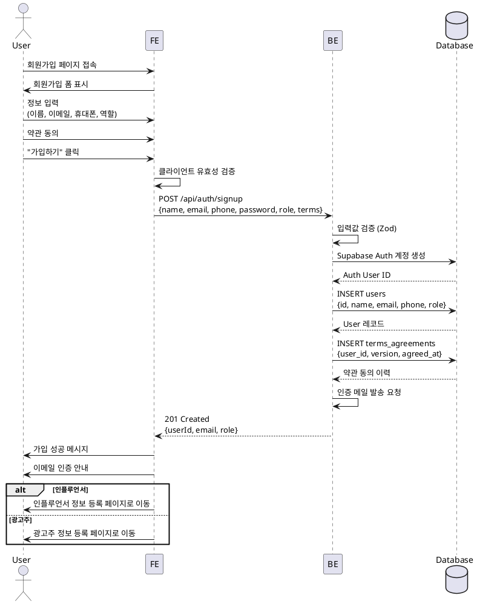

npm # UC-001: 회원가입 & 역할선택

## Primary Actor
- 신규 사용자 (비로그인 상태)

## Precondition
- 사용자가 회원가입 페이지에 접근 가능
- 약관 및 개인정보처리방침이 제공됨

## Trigger
- 사용자가 "회원가입" 버튼 클릭

## Main Scenario

1. 사용자가 회원가입 폼에 정보 입력
   - 이름
   - 휴대폰번호
   - 이메일
   - 비밀번호
   - 역할 선택 (인플루언서 / 광고주)
   
2. 사용자가 약관에 동의 (필수/선택 구분)

3. 사용자가 "가입하기" 버튼 클릭

4. 시스템이 입력값 유효성 검증
   - 이메일 형식
   - 휴대폰번호 형식
   - 비밀번호 강도

5. 시스템이 Supabase Auth 계정 생성

6. 시스템이 users 테이블에 프로필 정보 저장

7. 시스템이 terms_agreements 테이블에 약관 동의 이력 저장

8. 시스템이 인증 메일 발송

9. 사용자에게 성공 메시지 표시 및 이메일 인증 안내

10. 역할에 따라 다음 단계로 리다이렉트
    - 인플루언서 → 인플루언서 정보 등록 페이지
    - 광고주 → 광고주 정보 등록 페이지

## Edge Cases

### 이메일 중복
- **발생**: 이미 가입된 이메일로 가입 시도
- **처리**: "이미 사용 중인 이메일입니다" 에러 메시지 표시

### 잘못된 이메일 형식
- **발생**: 유효하지 않은 이메일 형식 입력
- **처리**: "유효한 이메일을 입력해주세요" 에러 메시지 표시

### 비밀번호 강도 미달
- **발생**: 비밀번호가 최소 요구사항 미충족
- **처리**: "비밀번호는 8자 이상, 영문/숫자 포함" 에러 메시지 표시

### 필수 약관 미동의
- **발생**: 필수 약관 동의하지 않고 가입 시도
- **처리**: "필수 약관에 동의해주세요" 에러 메시지 표시

### 레이트 리밋 초과
- **발생**: 짧은 시간 내 여러 번 가입 시도
- **처리**: "잠시 후 다시 시도해주세요" 에러 메시지 표시

### Auth 생성 실패
- **발생**: Supabase Auth 서버 오류
- **처리**: "일시적인 오류가 발생했습니다. 다시 시도해주세요" 에러 메시지 표시

## Business Rules

### BR-001: 역할 고유성
- 한 사용자는 하나의 역할만 가질 수 있음 (influencer 또는 advertiser)

### BR-002: 이메일 고유성
- 이메일은 시스템 내에서 고유해야 함

### BR-003: 필수 정보
- 이름, 휴대폰번호, 이메일, 역할은 필수 입력 항목

### BR-004: 약관 동의
- 필수 약관에 동의해야만 가입 가능
- 약관 동의 이력은 감사 목적으로 보관

### BR-005: 이메일 인증
- 가입 후 이메일 인증 필요 (선택적 강제 가능)

### BR-006: 프로필 완성도
- 가입 후 역할별 추가 정보 등록 필요 (인플루언서/광고주 프로필)

## Sequence Diagram



## API Endpoint

**POST** `/api/auth/signup`

### Request Body
```typescript
{
  name: string;
  email: string;
  phone: string;
  password: string;
  role: 'influencer' | 'advertiser';
  terms: {
    required: boolean;
    marketing: boolean;
  };
}
```

### Response (201 Created)
```typescript
{
  userId: string;
  email: string;
  role: 'influencer' | 'advertiser';
  emailVerificationSent: boolean;
}
```

### Error Responses
- `400 Bad Request`: 유효성 검증 실패
- `409 Conflict`: 이메일 중복
- `429 Too Many Requests`: 레이트 리밋 초과
- `500 Internal Server Error`: 서버 오류

