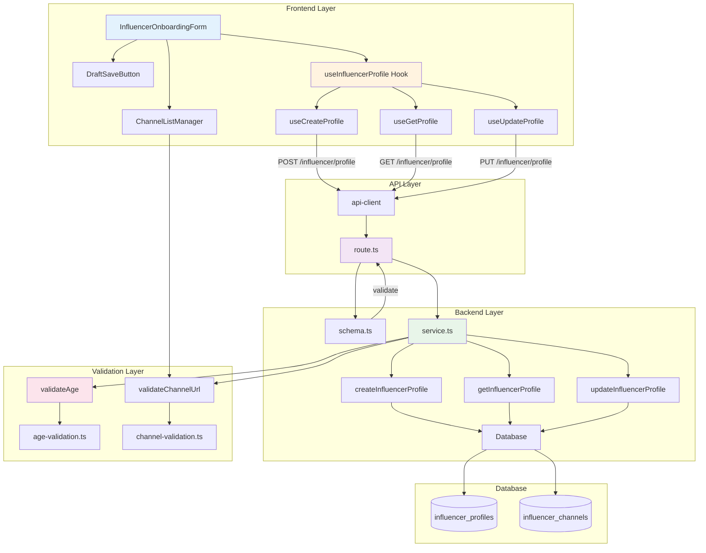

# UC-002: 인플루언서 정보 등록 - 구현 계획

## 개요

### 현재 상태 (Already Implemented)

| 모듈 | 위치 | 상태 |
|------|------|------|
| **service.ts** | `src/features/influencer/backend/service.ts` | ✅ 기본 생성 로직 구현됨 |
| **route.ts** | `src/features/influencer/backend/route.ts` | ✅ POST /influencer/profile 구현됨 |
| **schema.ts** | `src/features/influencer/backend/schema.ts` | ✅ 기본 스키마 정의됨 |
| **error.ts** | `src/features/influencer/backend/error.ts` | ✅ 에러 코드 정의됨 |
| **InfluencerOnboardingForm** | `src/features/influencer/components/InfluencerOnboardingForm.tsx` | ✅ 기본 폼 구현됨 |

### 추가 구현 필요 모듈

| 모듈 | 위치 | 설명 |
|------|------|------|
| **getInfluencerProfile** | `src/features/influencer/backend/service.ts` | 프로필 조회 (임시저장 이어하기) |
| **updateInfluencerProfile** | `src/features/influencer/backend/service.ts` | 프로필 수정 |
| **GET /influencer/profile** | `src/features/influencer/backend/route.ts` | 프로필 조회 API |
| **PUT /influencer/profile** | `src/features/influencer/backend/route.ts` | 프로필 수정 API |
| **validateAge** | `src/lib/validation/age.ts` | 만 14세 이상 검증 |
| **validateChannelUrl** | `src/lib/validation/channel.ts` | 채널 URL 패턴 검증 |
| **ChannelListManager** | `src/features/influencer/components/ChannelListManager.tsx` | 채널 추가/삭제 UI |
| **DraftSaveButton** | `src/features/influencer/components/DraftSaveButton.tsx` | 임시저장 버튼 |

### 공통 모듈 (Shared)

| 모듈 | 위치 | 설명 |
|------|------|------|
| **age-validation.ts** | `src/lib/validation/age.ts` | 생년월일 기반 나이 계산 및 검증 |
| **channel-validation.ts** | `src/lib/validation/channel.ts` | SNS 채널 URL 패턴 매칭 |
| **profile-guard.ts** | `src/lib/guards/profile.ts` | 프로필 상태 기반 권한 체크 |

---

## Diagram



---

## Implementation Plan

### 1️⃣ Backend Layer - Service Extensions

#### 1.1 Profile Retrieval (`src/features/influencer/backend/service.ts`)

**목적**: 기존 프로필 조회 (임시저장 이어하기)

**구현 내용**:
```typescript
export const getInfluencerProfileByUserId = async (
  client: SupabaseClient,
  userId: string
): Promise<HandlerResult<InfluencerProfileResponse | null, InfluencerServiceError, unknown>> => {
  // 1. influencer_profiles 조회
  // 2. influencer_channels 조회 (1:N)
  // 3. 응답 매핑 및 검증
  // 4. 프로필이 없으면 null 반환 (에러 아님)
}
```

**Unit Tests**:
```typescript
describe('getInfluencerProfileByUserId', () => {
  it('기존 프로필이 있으면 반환한다', async () => {
    // Given: 프로필이 존재하는 userId
    // When: getInfluencerProfileByUserId() 호출
    // Then: ok: true, 프로필 데이터 포함
  });

  it('프로필이 없으면 null을 반환한다', async () => {
    // Given: 프로필이 없는 userId
    // When: getInfluencerProfileByUserId() 호출
    // Then: ok: true, data: null
  });

  it('채널 목록을 함께 반환한다', async () => {
    // Given: 여러 채널을 가진 프로필
    // When: getInfluencerProfileByUserId() 호출
    // Then: channels 배열에 모든 채널 포함
  });
});
```

---

#### 1.2 Profile Update (`src/features/influencer/backend/service.ts`)

**목적**: 프로필 수정 (승인 전에만 가능)

**구현 내용**:
```typescript
export const updateInfluencerProfile = async (
  client: SupabaseClient,
  userId: string,
  data: InfluencerProfileUpdateRequest
): Promise<HandlerResult<InfluencerProfileResponse, InfluencerServiceError, unknown>> => {
  // 1. 기존 프로필 조회
  // 2. profile_status 확인 (draft/pending만 수정 가능)
  // 3. influencer_profiles 업데이트
  // 4. 기존 channels 삭제 후 재생성
  // 5. 트랜잭션 처리
}
```

**Unit Tests**:
```typescript
describe('updateInfluencerProfile', () => {
  it('draft 상태의 프로필은 수정 가능하다', async () => {});
  it('pending 상태의 프로필은 수정 가능하다', async () => {});
  it('approved 상태의 프로필은 수정 불가하다', async () => {});
  it('채널 목록을 완전히 교체한다', async () => {});
  it('트랜잭션 실패 시 롤백한다', async () => {});
});
```

---

#### 1.3 Schema Extensions (`src/features/influencer/backend/schema.ts`)

**추가 스키마**:
```typescript
// isDraft 파라미터 추가
export const InfluencerProfileCreateSchema = z.object({
  birthDate: z.string().regex(/^\d{4}-\d{2}-\d{2}$/),
  channels: z.array(ChannelSchema).min(1, '최소 1개 이상의 채널을 등록해주세요'),
  isDraft: z.boolean().default(false), // 추가
});

// Update 스키마
export const InfluencerProfileUpdateSchema = InfluencerProfileCreateSchema;
export type InfluencerProfileUpdateRequest = z.infer<typeof InfluencerProfileUpdateSchema>;
```

---

#### 1.4 Route Extensions (`src/features/influencer/backend/route.ts`)

**추가 라우트**:
```typescript
// GET /influencer/profile - 조회 (이미 구현됨)
app.get('/influencer/profile', async (c) => {
  // getInfluencerProfileByUserId() 호출
  // 없으면 null 반환
});

// PUT /influencer/profile - 수정
app.put('/influencer/profile', async (c) => {
  // body 파싱 및 검증
  // updateInfluencerProfile() 호출
  // 상태 확인 및 에러 처리
});
```

**Unit Tests**:
```typescript
describe('GET /influencer/profile', () => {
  it('프로필이 있으면 200과 데이터를 반환한다', async () => {});
  it('프로필이 없으면 200과 null을 반환한다', async () => {});
  it('인증되지 않은 요청은 401을 반환한다', async () => {});
});

describe('PUT /influencer/profile', () => {
  it('유효한 요청 시 200을 반환한다', async () => {});
  it('approved 상태 프로필 수정 시 403을 반환한다', async () => {});
  it('스키마 검증 실패 시 400을 반환한다', async () => {});
});
```

---

### 2️⃣ Validation Layer

#### 2.1 Age Validation (`src/lib/validation/age.ts`)

**목적**: 만 14세 이상 검증

**구현 내용**:
```typescript
export const calculateAge = (birthDate: string): number => {
  const today = new Date();
  const birth = new Date(birthDate);
  let age = today.getFullYear() - birth.getFullYear();
  const monthDiff = today.getMonth() - birth.getMonth();
  
  if (monthDiff < 0 || (monthDiff === 0 && today.getDate() < birth.getDate())) {
    age--;
  }
  
  return age;
};

export const isAgeValid = (birthDate: string, minAge: number = 14): boolean => {
  return calculateAge(birthDate) >= minAge;
};

export const validateAge = (birthDate: string): { valid: boolean; age: number; message?: string } => {
  const age = calculateAge(birthDate);
  
  if (age < 14) {
    return {
      valid: false,
      age,
      message: '만 14세 이상만 가입 가능합니다',
    };
  }
  
  return { valid: true, age };
};
```

**Unit Tests**:
```typescript
describe('calculateAge', () => {
  it('정확한 나이를 계산한다', () => {
    // Given: 생년월일
    // When: calculateAge() 호출
    // Then: 정확한 만 나이 반환
  });

  it('생일이 지나지 않았으면 -1을 적용한다', () => {});
});

describe('isAgeValid', () => {
  it('14세 이상이면 true를 반환한다', () => {});
  it('14세 미만이면 false를 반환한다', () => {});
});
```

---

#### 2.2 Channel URL Validation (`src/lib/validation/channel.ts`)

**목적**: SNS 채널 URL 패턴 매칭

**구현 내용**:
```typescript
const CHANNEL_PATTERNS: Record<ChannelType, RegExp> = {
  instagram: /^https?:\/\/(www\.)?instagram\.com\/[a-zA-Z0-9._]+\/?$/,
  youtube: /^https?:\/\/(www\.)?(youtube\.com|youtu\.be)\/.+$/,
  blog: /^https?:\/\/.+\.(blog\.me|tistory\.com|com\/blog).*/,
  tiktok: /^https?:\/\/(www\.)?tiktok\.com\/@[a-zA-Z0-9._]+\/?$/,
};

export const validateChannelUrl = (
  channelType: ChannelType,
  url: string
): { valid: boolean; message?: string } => {
  const pattern = CHANNEL_PATTERNS[channelType];
  
  if (!pattern.test(url)) {
    return {
      valid: false,
      message: `선택한 채널 유형(${channelType})과 URL이 일치하지 않습니다`,
    };
  }
  
  return { valid: true };
};

export const isValidUrl = (url: string): boolean => {
  try {
    new URL(url);
    return true;
  } catch {
    return false;
  }
};
```

**Unit Tests**:
```typescript
describe('validateChannelUrl', () => {
  it('Instagram URL은 instagram 타입과 매칭된다', () => {});
  it('YouTube URL은 youtube 타입과 매칭된다', () => {});
  it('타입과 맞지 않는 URL은 실패한다', () => {});
  it('잘못된 URL 형식은 실패한다', () => {});
});
```

---

### 3️⃣ Frontend Layer

#### 3.1 Channel List Manager (`src/features/influencer/components/ChannelListManager.tsx`)

**목적**: 채널 추가/삭제 UI

**구현 내용**:
```typescript
type ChannelListManagerProps = {
  channels: Channel[];
  onChange: (channels: Channel[]) => void;
  errors?: FieldErrors;
};

export function ChannelListManager({ channels, onChange, errors }: ChannelListManagerProps) {
  const handleAddChannel = () => {
    onChange([...channels, { channelType: 'instagram', channelName: '', channelUrl: '' }]);
  };

  const handleRemoveChannel = (index: number) => {
    onChange(channels.filter((_, i) => i !== index));
  };

  const handleChannelChange = (index: number, field: keyof Channel, value: string) => {
    const updated = [...channels];
    updated[index] = { ...updated[index], [field]: value };
    onChange(updated);
  };

  return (
    <div className="space-y-4">
      {channels.map((channel, index) => (
        <ChannelInput
          key={index}
          channel={channel}
          onChange={(field, value) => handleChannelChange(index, field, value)}
          onRemove={() => handleRemoveChannel(index)}
          error={errors?.[index]}
        />
      ))}
      
      <Button type="button" variant="outline" onClick={handleAddChannel}>
        + 채널 추가
      </Button>
    </div>
  );
}
```

**QA Sheet**:
```yaml
# 동작
- [ ] "채널 추가" 클릭 시 새 채널 입력 필드 추가
- [ ] 삭제 버튼 클릭 시 해당 채널 제거
- [ ] 채널 타입 변경 시 URL 검증
- [ ] 최소 1개 채널 필수 (마지막 채널 삭제 불가)

# UI/UX
- [ ] 채널별 구분선 명확
- [ ] 드래그로 순서 변경 (선택 구현)
- [ ] 실시간 URL 검증 피드백

# 접근성
- [ ] 키보드로 채널 추가/삭제
- [ ] 에러 메시지 스크린리더 읽기
```

---

#### 3.2 Draft Save Feature

**구현 내용**:
```typescript
// InfluencerOnboardingForm에 추가
const handleDraftSave = () => {
  const values = form.getValues();
  createProfile.mutate({ ...values, isDraft: true });
};

const handleSubmit = (data: FormData) => {
  createProfile.mutate({ ...data, isDraft: false });
};

return (
  <Form>
    {/* ...fields... */}
    
    <div className="flex gap-4">
      <Button type="button" variant="outline" onClick={handleDraftSave}>
        임시저장
      </Button>
      <Button type="submit">
        제출
      </Button>
    </div>
  </Form>
);
```

**QA Sheet**:
```yaml
# 동작
- [ ] 임시저장 시 profile_status = 'draft'
- [ ] 제출 시 profile_status = 'pending'
- [ ] 임시저장 후 "나중에 이어서 작성" 안내
- [ ] 제출 후 "채널 검증 중" 안내

# UI/UX
- [ ] 버튼 구분 명확 (Primary vs Secondary)
- [ ] 저장 성공 토스트 메시지
```

---

#### 3.3 Profile Load on Mount

**구현 내용**:
```typescript
// useInfluencerProfile 훅에 추가
export const useGetInfluencerProfile = () => {
  return useQuery({
    queryKey: ['influencer-profile'],
    queryFn: async () => {
      const response = await apiClient.get('/influencer/profile');
      return response.data;
    },
  });
};

// InfluencerOnboardingForm에서 사용
const { data: existingProfile } = useGetInfluencerProfile();

useEffect(() => {
  if (existingProfile) {
    form.reset({
      birthDate: existingProfile.birthDate,
      channels: existingProfile.channels,
    });
  }
}, [existingProfile, form]);
```

**QA Sheet**:
```yaml
# 동작
- [ ] 페이지 로드 시 기존 프로필 조회
- [ ] 프로필이 있으면 폼에 자동 채움
- [ ] 프로필이 없으면 빈 폼 표시

# UI/UX
- [ ] 로딩 중 스켈레톤 UI
- [ ] 데이터 로드 후 부드러운 전환
```

---

### 4️⃣ Integration

#### 4.1 Service Layer Integration

**수정 내용**:
```typescript
// createInfluencerProfile에 age 검증 추가
const ageValidation = validateAge(data.birthDate);
if (!ageValidation.valid) {
  return failure(400, influencerErrorCodes.ageBelowMinimum, ageValidation.message);
}

// 채널 URL 검증 추가
for (const channel of data.channels) {
  const urlValidation = validateChannelUrl(channel.channelType, channel.channelUrl);
  if (!urlValidation.valid) {
    return failure(400, influencerErrorCodes.invalidChannelUrl, urlValidation.message);
  }
}

// isDraft 파라미터에 따라 profile_status 설정
const profileStatus = data.isDraft ? 'draft' : 'pending';
```

---

#### 4.2 Error Codes Extension (`src/features/influencer/backend/error.ts`)

**추가 에러 코드**:
```typescript
export const influencerErrorCodes = {
  // ... 기존 코드 ...
  ageBelowMinimum: 'AGE_BELOW_MINIMUM',
  invalidChannelUrl: 'INVALID_CHANNEL_URL',
  channelPatternMismatch: 'CHANNEL_PATTERN_MISMATCH',
  duplicateChannelUrl: 'DUPLICATE_CHANNEL_URL',
  profileNotEditable: 'PROFILE_NOT_EDITABLE',
} as const;
```

---

## 구현 순서

### Phase 1: Validation Layer
1. ✅ age-validation.ts 구현 및 테스트
2. ✅ channel-validation.ts 구현 및 테스트

### Phase 2: Backend Extensions
3. ✅ Schema에 isDraft 추가
4. ✅ getInfluencerProfileByUserId 구현 및 테스트
5. ✅ updateInfluencerProfile 구현 및 테스트
6. ✅ createInfluencerProfile에 검증 로직 추가
7. ✅ Route에 GET, PUT 추가

### Phase 3: Frontend Components
8. ✅ ChannelListManager 컴포넌트 구현
9. ✅ useGetInfluencerProfile 훅 구현
10. ✅ useUpdateInfluencerProfile 훅 구현
11. ✅ InfluencerOnboardingForm 개선 (임시저장, 프로필 로드)

### Phase 4: Integration & Testing
12. ✅ E2E 시나리오 테스트
13. ✅ Edge Case 검증
14. ✅ UX 검증 (QA Sheet)

---

## 테스트 전략

### Unit Tests
- ✅ Age validation (만 14세 계산 정확도)
- ✅ Channel URL pattern matching
- ✅ Service 로직 (조회, 생성, 수정)

### Integration Tests
- ✅ GET /influencer/profile (프로필 있음/없음)
- ✅ PUT /influencer/profile (상태별 수정 가능 여부)
- ✅ isDraft 파라미터에 따른 status 변경

### Component Tests
- ✅ ChannelListManager (추가/삭제/변경)
- ✅ DraftSave 기능
- ✅ Profile Load & Autofill

### E2E Tests (QA Sheet)
- ✅ 임시저장 → 나중에 이어서 작성
- ✅ 만 14세 미만 제출 → 에러 메시지
- ✅ 채널 타입과 URL 불일치 → 에러 메시지
- ✅ 승인된 프로필 수정 시도 → 403 에러

---

## Dependencies

### 기존 shadcn-ui 컴포넌트 활용
- ✅ Button, Input, Select
- ✅ Form, Label
- ✅ Toast

### 기존 라이브러리 활용
- ✅ react-hook-form
- ✅ zod
- ✅ @tanstack/react-query
- ✅ date-fns (날짜 계산)

---

## 성능 고려사항

1. **중복 채널 체크**: DB 레벨에서 UNIQUE 제약조건 (선택 구현)
2. **채널 검증 비동기**: 초기 구현은 동기, 추후 비동기 잡 큐 추가
3. **프로필 캐싱**: React Query 자동 캐싱 활용

---

## 보안 고려사항

1. **프로필 수정 권한**: 본인 프로필만 수정 가능 (userId 검증)
2. **상태 전환 검증**: 승인된 프로필 수정 방지
3. **URL 검증**: XSS 방지를 위한 URL 포맷 검증

---

## 향후 개선사항

1. 채널 검증 비동기 잡 구현 (Supabase Edge Functions)
2. 팔로워 수 자동 수집 (OAuth 연동)
3. 채널 순서 드래그 앤 드롭
4. 프로필 승인 워크플로우 (관리자 페이지)

