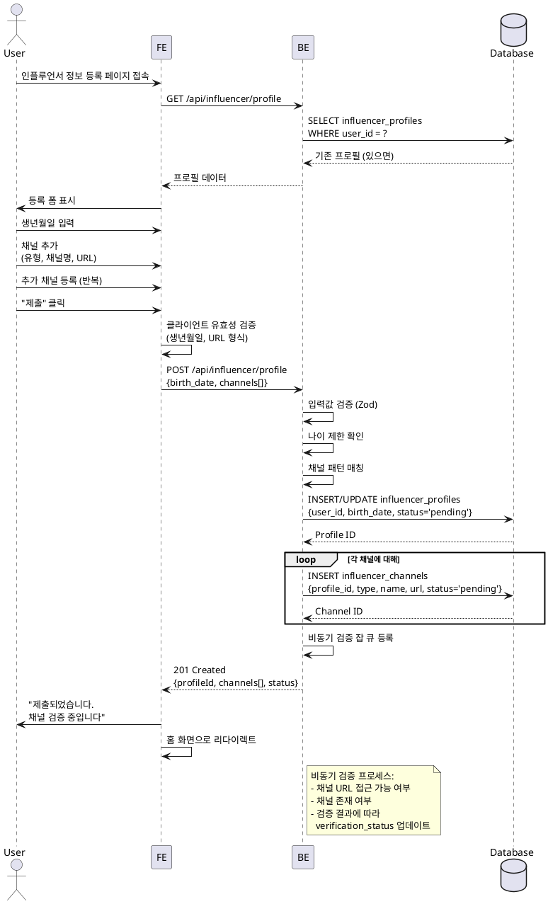

# UC-002: 인플루언서 정보 등록

## Primary Actor
- 인플루언서 역할로 가입한 사용자

## Precondition
- 사용자가 회원가입 완료 (role = 'influencer')
- 사용자가 로그인 상태
- 인플루언서 프로필이 아직 생성되지 않았거나 'draft' 상태

## Trigger
- 회원가입 완료 후 자동 리다이렉트
- 또는 프로필 등록 페이지 직접 접근

## Main Scenario

1. 사용자가 인플루언서 정보 등록 페이지 접속

2. 시스템이 등록 폼 표시

3. 사용자가 기본 정보 입력
   - 생년월일

4. 사용자가 SNS 채널 추가
   - 채널 유형 선택 (Instagram, YouTube, 블로그, TikTok)
   - 채널명 입력
   - 채널 URL 입력
   
5. 사용자가 추가 채널 등록 (선택사항, 여러 개 가능)

6. 사용자가 "제출" 또는 "임시저장" 선택

7. 시스템이 입력값 유효성 검증
   - 생년월일 형식 및 나이 정책 (예: 만 14세 이상)
   - URL 형식 및 채널별 패턴 매칭

8. 시스템이 influencer_profiles 테이블에 저장

9. 시스템이 influencer_channels 테이블에 채널 정보 저장

10. 시스템이 비동기 검증 잡 큐에 등록

11. 사용자에게 성공 메시지 표시
    - 임시저장: "임시저장되었습니다. 나중에 이어서 작성할 수 있습니다"
    - 제출: "제출되었습니다. 채널 검증 중입니다"

12. 제출 완료 시 홈 화면으로 이동

## Edge Cases

### 나이 제한 미달
- **발생**: 만 14세 미만 생년월일 입력
- **처리**: "만 14세 이상만 가입 가능합니다" 에러 메시지 표시

### 잘못된 URL 형식
- **발생**: 유효하지 않은 URL 입력
- **처리**: "올바른 URL 형식을 입력해주세요" 에러 메시지 표시

### 채널 패턴 불일치
- **발생**: Instagram을 선택했지만 YouTube URL 입력
- **처리**: "선택한 채널 유형과 URL이 일치하지 않습니다" 에러 메시지 표시

### 채널 미등록
- **발생**: SNS 채널을 하나도 추가하지 않고 제출
- **처리**: "최소 1개 이상의 SNS 채널을 등록해주세요" 에러 메시지 표시

### 중복 URL
- **발생**: 이미 등록된 채널 URL을 다시 등록 시도
- **처리**: "이미 등록된 채널입니다" 경고 메시지 표시

### 채널 검증 실패
- **발생**: 존재하지 않거나 접근 불가능한 채널
- **처리**: 프로필 페이지에서 "검증 실패" 상태 표시, 재등록 안내

## Business Rules

### BR-001: 나이 제한
- 만 14세 이상만 인플루언서 등록 가능

### BR-002: 최소 채널 수
- 최소 1개 이상의 SNS 채널 등록 필수

### BR-003: 프로필 상태 전환
- draft (임시저장) → pending (제출, 검증 대기) → approved/rejected

### BR-004: 채널 검증
- 모든 채널은 비동기 검증 프로세스를 거침
- 검증 완료 전까지 체험단 지원 불가

### BR-005: 프로필 수정
- 승인 전에는 자유롭게 수정 가능
- 승인 후에는 관리자 검토 후 수정 가능

### BR-006: 다중 채널
- 한 인플루언서는 여러 SNS 채널 등록 가능

## Sequence Diagram



## API Endpoints

### GET `/api/influencer/profile`
기존 프로필 조회 (임시저장 이어하기)

### Response (200 OK)
```typescript
{
  profile: {
    id: string;
    birthDate: string;
    status: 'draft' | 'pending' | 'approved' | 'rejected';
  } | null;
  channels: Array<{
    id: string;
    type: 'instagram' | 'youtube' | 'blog' | 'tiktok';
    name: string;
    url: string;
    verificationStatus: 'pending' | 'verified' | 'failed';
  }>;
}
```

### POST `/api/influencer/profile`
프로필 등록/수정

### Request Body
```typescript
{
  birthDate: string; // YYYY-MM-DD
  channels: Array<{
    type: 'instagram' | 'youtube' | 'blog' | 'tiktok';
    name: string;
    url: string;
  }>;
  isDraft: boolean; // true면 임시저장, false면 제출
}
```

### Response (201 Created)
```typescript
{
  profileId: string;
  status: 'draft' | 'pending';
  channels: Array<{
    id: string;
    verificationStatus: 'pending';
  }>;
}
```

### Error Responses
- `400 Bad Request`: 유효성 검증 실패
- `403 Forbidden`: 인플루언서 역할 아님
- `409 Conflict`: 중복 채널 URL
- `500 Internal Server Error`: 서버 오류

