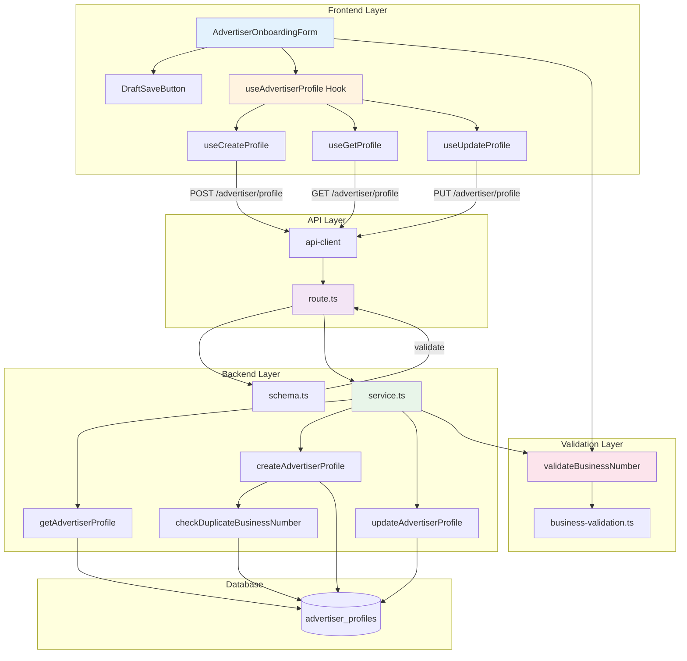

# UC-003: 광고주 정보 등록 - 구현 계획

## 개요

### 현재 상태 (Already Implemented)

| 모듈 | 위치 | 상태 |
|------|------|------|
| **service.ts** | `src/features/advertiser/backend/service.ts` | ✅ 기본 생성 로직 구현됨 |
| **route.ts** | `src/features/advertiser/backend/route.ts` | ✅ POST /advertiser/profile 구현됨 |
| **schema.ts** | `src/features/advertiser/backend/schema.ts` | ✅ 기본 스키마 정의됨 |
| **error.ts** | `src/features/advertiser/backend/error.ts` | ✅ 에러 코드 정의됨 |
| **AdvertiserOnboardingForm** | `src/features/advertiser/components/AdvertiserOnboardingForm.tsx` | ✅ 기본 폼 구현됨 |

### 추가 구현 필요 모듈

| 모듈 | 위치 | 설명 |
|------|------|------|
| **getAdvertiserProfile** | `src/features/advertiser/backend/service.ts` | 프로필 조회 (임시저장 이어하기) |
| **updateAdvertiserProfile** | `src/features/advertiser/backend/service.ts` | 프로필 수정 |
| **GET /advertiser/profile** | `src/features/advertiser/backend/route.ts` | 프로필 조회 API |
| **PUT /advertiser/profile** | `src/features/advertiser/backend/route.ts` | 프로필 수정 API |
| **validateBusinessNumber** | `src/lib/validation/business.ts` | 사업자등록번호 형식 검증 |
| **checkDuplicateBusinessNumber** | `src/features/advertiser/backend/service.ts` | 중복 사업자번호 체크 |
| **DraftSaveButton** | `src/features/advertiser/components/DraftSaveButton.tsx` | 임시저장 버튼 |

### 공통 모듈 (Shared)

| 모듈 | 위치 | 설명 |
|------|------|------|
| **business-validation.ts** | `src/lib/validation/business.ts` | 사업자등록번호 형식 검증 및 체크섬 |
| **rate-limiter.ts** | `src/backend/middleware/rate-limit.ts` | 요청 빈도 제한 (선택 구현) |

---

## Diagram



---

## Implementation Plan

### 1️⃣ Backend Layer - Service Extensions

#### 1.1 Profile Retrieval

**구현 내용**:
```typescript
export const getAdvertiserProfileByUserId = async (
  client: SupabaseClient,
  userId: string
): Promise<HandlerResult<AdvertiserProfileResponse | null, AdvertiserServiceError, unknown>> => {
  // 1. advertiser_profiles 조회
  // 2. 응답 매핑 및 검증
  // 3. 프로필이 없으면 null 반환
}
```

**Unit Tests**:
```typescript
describe('getAdvertiserProfileByUserId', () => {
  it('기존 프로필이 있으면 반환한다', () => {});
  it('프로필이 없으면 null을 반환한다', () => {});
  it('검증 상태를 포함한다', () => {});
});
```

---

#### 1.2 Profile Update

**구현 내용**:
```typescript
export const updateAdvertiserProfile = async (
  client: SupabaseClient,
  userId: string,
  data: AdvertiserProfileUpdateRequest
): Promise<HandlerResult<AdvertiserProfileResponse, AdvertiserServiceError, unknown>> => {
  // 1. 기존 프로필 조회
  // 2. verification_status 확인 (pending만 수정 가능)
  // 3. 사업자번호 변경 시 중복 체크
  // 4. advertiser_profiles 업데이트
  // 5. 사업자번호 변경 시 재검증 필요 (status → pending)
}
```

**Unit Tests**:
```typescript
describe('updateAdvertiserProfile', () => {
  it('pending 상태의 프로필은 수정 가능하다', () => {});
  it('verified 상태 프로필 수정 시 재검증 필요', () => {});
  it('사업자번호 중복 체크를 수행한다', () => {});
  it('사업자번호 변경 시 status를 pending으로 변경한다', () => {});
});
```

---

#### 1.3 Schema Extensions

**추가 스키마**:
```typescript
export const AdvertiserProfileCreateSchema = z.object({
  companyName: z.string().min(1).max(200),
  location: z.string().min(1).max(500),
  category: z.string().min(1).max(100),
  businessNumber: z.string().regex(/^\d{3}-\d{2}-\d{5}$/),
  isDraft: z.boolean().default(false), // 추가
});

export const AdvertiserProfileUpdateSchema = AdvertiserProfileCreateSchema;
export type AdvertiserProfileUpdateRequest = z.infer<typeof AdvertiserProfileUpdateSchema>;
```

---

#### 1.4 Route Extensions

**추가 라우트**:
```typescript
// GET /advertiser/profile
app.get('/advertiser/profile', async (c) => {
  // getAdvertiserProfileByUserId() 호출
});

// PUT /advertiser/profile
app.put('/advertiser/profile', async (c) => {
  // updateAdvertiserProfile() 호출
});
```

**Unit Tests**:
```typescript
describe('GET /advertiser/profile', () => {
  it('프로필이 있으면 200을 반환한다', () => {});
  it('프로필이 없으면 200과 null을 반환한다', () => {});
});

describe('PUT /advertiser/profile', () => {
  it('유효한 요청 시 200을 반환한다', () => {});
  it('중복 사업자번호 시 409를 반환한다', () => {});
});
```

---

### 2️⃣ Validation Layer

#### 2.1 Business Number Validation (`src/lib/validation/business.ts`)

**목적**: 사업자등록번호 형식 검증 및 체크섬

**구현 내용**:
```typescript
export const formatBusinessNumber = (number: string): string => {
  // 숫자만 추출
  const numbers = number.replace(/\D/g, '');
  
  // 000-00-00000 포맷
  if (numbers.length === 10) {
    return numbers.replace(/(\d{3})(\d{2})(\d{5})/, '$1-$2-$3');
  }
  
  return number;
};

export const validateBusinessNumberFormat = (number: string): boolean => {
  const regex = /^\d{3}-\d{2}-\d{5}$/;
  return regex.test(number);
};

export const validateBusinessNumberChecksum = (number: string): boolean => {
  // 체크섬 알고리즘 구현 (선택 구현)
  // https://www.nts.go.kr/nts/cm/cntnts/cntntsView.do?mi=2292&cntntsId=7674
  const numbers = number.replace(/-/g, '');
  const checkArray = [1, 3, 7, 1, 3, 7, 1, 3, 5];
  
  let sum = 0;
  for (let i = 0; i < 9; i++) {
    sum += parseInt(numbers[i]) * checkArray[i];
  }
  
  sum += Math.floor((parseInt(numbers[8]) * 5) / 10);
  const checkDigit = (10 - (sum % 10)) % 10;
  
  return checkDigit === parseInt(numbers[9]);
};

export const validateBusinessNumber = (number: string): {
  valid: boolean;
  message?: string;
} => {
  if (!validateBusinessNumberFormat(number)) {
    return {
      valid: false,
      message: '올바른 사업자등록번호 형식이 아닙니다 (000-00-00000)',
    };
  }
  
  if (!validateBusinessNumberChecksum(number)) {
    return {
      valid: false,
      message: '유효하지 않은 사업자등록번호입니다',
    };
  }
  
  return { valid: true };
};
```

**Unit Tests**:
```typescript
describe('formatBusinessNumber', () => {
  it('10자리 숫자를 000-00-00000 형식으로 변환한다', () => {});
});

describe('validateBusinessNumberFormat', () => {
  it('올바른 형식은 true를 반환한다', () => {});
  it('잘못된 형식은 false를 반환한다', () => {});
});

describe('validateBusinessNumberChecksum', () => {
  it('유효한 사업자번호는 true를 반환한다', () => {
    expect(validateBusinessNumberChecksum('101-81-12345')).toBe(true);
  });
  it('체크섬이 맞지 않으면 false를 반환한다', () => {});
});
```

---

### 3️⃣ Frontend Layer

#### 3.1 Draft Save & Profile Load

**구현 내용**:
```typescript
// useAdvertiserProfile 훅에 추가
export const useGetAdvertiserProfile = () => {
  return useQuery({
    queryKey: ['advertiser-profile'],
    queryFn: async () => {
      const response = await apiClient.get('/advertiser/profile');
      return response.data;
    },
  });
};

export const useUpdateAdvertiserProfile = () => {
  return useMutation({
    mutationFn: async (data: AdvertiserProfileUpdateRequest) => {
      const response = await apiClient.put('/advertiser/profile', data);
      return response.data;
    },
  });
};

// AdvertiserOnboardingForm에서 사용
const { data: existingProfile } = useGetAdvertiserProfile();

useEffect(() => {
  if (existingProfile) {
    form.reset(existingProfile);
  }
}, [existingProfile, form]);

const handleDraftSave = () => {
  const values = form.getValues();
  createProfile.mutate({ ...values, isDraft: true });
};
```

**QA Sheet**:
```yaml
# 동작
- [ ] 페이지 로드 시 기존 프로필 조회 및 자동 채움
- [ ] 임시저장 시 verification_status = 'pending'
- [ ] 제출 시 사업자번호 검증 트리거

# UI/UX
- [ ] 사업자번호 자동 포맷팅 (하이픈 추가)
- [ ] 실시간 형식 검증 피드백
- [ ] 임시저장/제출 버튼 구분
```

---

#### 3.2 Business Number Input Enhancement

**구현 내용**:
```typescript
// 사업자번호 입력 필드에 자동 포맷팅 적용
<Input
  {...field}
  onChange={(e) => {
    const formatted = formatBusinessNumber(e.target.value);
    field.onChange(formatted);
  }}
  placeholder="000-00-00000"
/>
```

---

### 4️⃣ Integration

#### 4.1 Service Layer Integration

**수정 내용**:
```typescript
// createAdvertiserProfile에 검증 추가
const businessValidation = validateBusinessNumber(data.businessNumber);
if (!businessValidation.valid) {
  return failure(400, advertiserErrorCodes.invalidBusinessNumber, businessValidation.message);
}

// isDraft 파라미터 처리
const verificationStatus = data.isDraft ? 'pending' : 'pending'; // 항상 pending
```

---

#### 4.2 Error Codes Extension

**추가 에러 코드**:
```typescript
export const advertiserErrorCodes = {
  // ... 기존 코드 ...
  invalidBusinessNumber: 'INVALID_BUSINESS_NUMBER',
  profileNotEditable: 'PROFILE_NOT_EDITABLE',
} as const;
```

---

## 구현 순서

### Phase 1: Validation Layer
1. ✅ business-validation.ts 구현 및 테스트

### Phase 2: Backend Extensions
2. ✅ Schema에 isDraft 추가
3. ✅ getAdvertiserProfileByUserId 구현
4. ✅ updateAdvertiserProfile 구현
5. ✅ Route에 GET, PUT 추가

### Phase 3: Frontend Components
6. ✅ useGetAdvertiserProfile 훅 구현
7. ✅ useUpdateAdvertiserProfile 훅 구현
8. ✅ AdvertiserOnboardingForm 개선

### Phase 4: Integration & Testing
9. ✅ E2E 시나리오 테스트
10. ✅ Edge Case 검증

---

## 테스트 전략

### Unit Tests
- ✅ Business number validation (형식, 체크섬)
- ✅ Service 로직 (조회, 생성, 수정)
- ✅ Duplicate check

### Integration Tests
- ✅ GET /advertiser/profile
- ✅ PUT /advertiser/profile
- ✅ Duplicate business number → 409

### E2E Tests
- ✅ 임시저장 → 이어서 작성
- ✅ 중복 사업자번호 제출 → 에러
- ✅ 체크섬 오류 → 에러

---

## Dependencies

### 기존 shadcn-ui 컴포넌트 활용
- ✅ Button, Input, Select, Form

### 기존 라이브러리 활용
- ✅ react-hook-form, zod, @tanstack/react-query

---

## 보안 고려사항

1. **사업자번호 중복 체크**: DB UNIQUE 제약조건 활용
2. **프로필 수정 권한**: 본인 프로필만 수정 가능
3. **레이트 리밋**: IP 기반 요청 제한 (선택 구현)

---

## 향후 개선사항

1. 국세청 API 연동 (사업자번호 실제 검증)
2. 사업자등록증 파일 업로드
3. 관리자 승인 워크플로우

