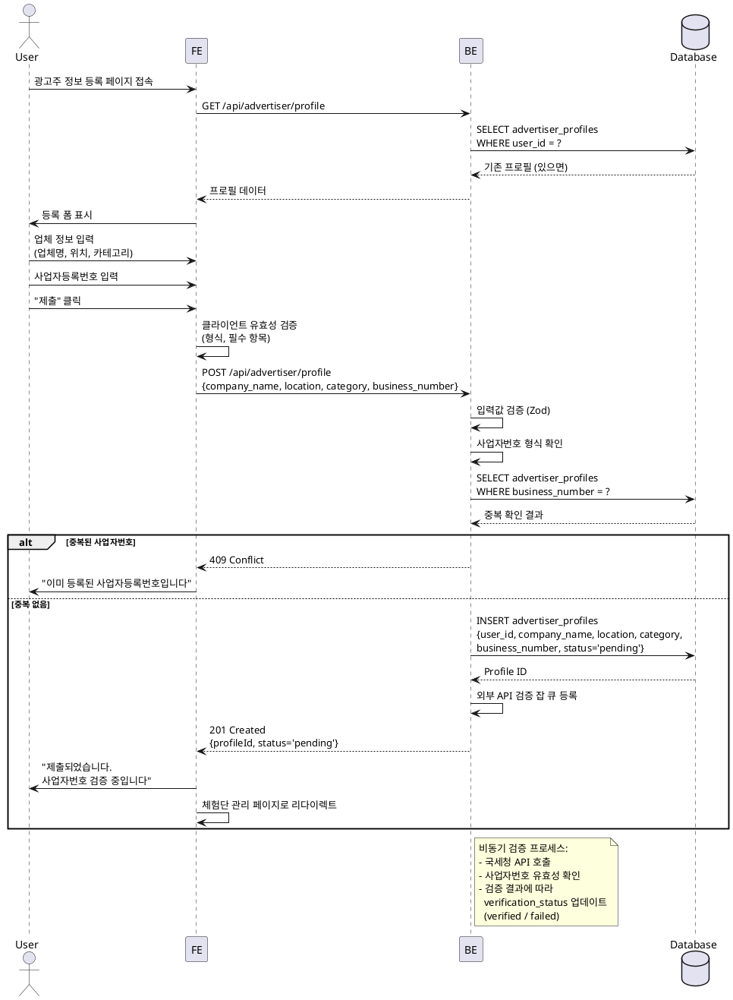

# UC-003: 광고주 정보 등록

## Primary Actor
- 광고주 역할로 가입한 사용자

## Precondition
- 사용자가 회원가입 완료 (role = 'advertiser')
- 사용자가 로그인 상태
- 광고주 프로필이 아직 생성되지 않음

## Trigger
- 회원가입 완료 후 자동 리다이렉트
- 또는 프로필 등록 페이지 직접 접근

## Main Scenario

1. 사용자가 광고주 정보 등록 페이지 접속

2. 시스템이 등록 폼 표시

3. 사용자가 업체 정보 입력
   - 업체명
   - 위치 (주소)
   - 카테고리 (예: 음식점, 카페, 뷰티 등)
   - 사업자등록번호

4. 사용자가 "제출" 또는 "임시저장" 선택

5. 시스템이 입력값 유효성 검증
   - 사업자등록번호 형식 (10자리 숫자)
   - 필수 항목 입력 여부

6. 시스템이 사업자등록번호 중복 확인

7. 시스템이 advertiser_profiles 테이블에 저장

8. 시스템이 외부 API 사업자번호 검증 잡 큐에 등록

9. 사용자에게 성공 메시지 표시
   - 임시저장: "임시저장되었습니다"
   - 제출: "제출되었습니다. 사업자번호 검증 중입니다"

10. 제출 완료 시 체험단 관리 페이지로 이동

## Edge Cases

### 사업자등록번호 형식 오류
- **발생**: 10자리 숫자가 아닌 값 입력
- **처리**: "올바른 사업자등록번호 형식을 입력해주세요 (10자리 숫자)" 에러 메시지

### 사업자등록번호 중복
- **발생**: 이미 등록된 사업자등록번호로 등록 시도
- **처리**: "이미 등록된 사업자등록번호입니다" 에러 메시지

### 필수 항목 누락
- **발생**: 업체명, 위치, 카테고리 중 하나라도 미입력
- **처리**: "모든 필수 항목을 입력해주세요" 에러 메시지

### 사업자번호 검증 실패
- **발생**: 외부 API에서 유효하지 않은 사업자번호로 판정
- **처리**: 프로필 페이지에서 "검증 실패" 상태 표시, 재등록 안내

### 외부 API 호출 실패
- **발생**: 사업자번호 검증 API 서버 오류
- **처리**: "검증 대기" 상태 유지, 재시도 스케줄링

### 레이트 리밋 초과
- **발생**: 짧은 시간 내 여러 번 제출 시도
- **처리**: "잠시 후 다시 시도해주세요" 에러 메시지

## Business Rules

### BR-001: 사업자등록번호 고유성
- 하나의 사업자등록번호는 하나의 광고주 계정에만 등록 가능

### BR-002: 필수 정보
- 업체명, 위치, 카테고리, 사업자등록번호는 필수 입력

### BR-003: 검증 상태
- pending (검증 대기) → verified (검증 완료) → 체험단 생성 가능
- 검증 실패 시 rejected 상태, 재등록 필요

### BR-004: 체험단 생성 권한
- verification_status가 'verified'인 광고주만 체험단 생성 가능

### BR-005: 프로필 수정
- 검증 완료 전에는 자유롭게 수정 가능
- 검증 완료 후 수정 시 재검증 필요

## Sequence Diagram



## API Endpoints

### GET `/api/advertiser/profile`
기존 프로필 조회 (임시저장 이어하기)

### Response (200 OK)
```typescript
{
  profile: {
    id: string;
    companyName: string;
    location: string;
    category: string;
    businessNumber: string;
    verificationStatus: 'pending' | 'verified' | 'failed';
  } | null;
}
```

### POST `/api/advertiser/profile`
프로필 등록/수정

### Request Body
```typescript
{
  companyName: string;
  location: string;
  category: string;
  businessNumber: string; // 10자리 숫자
  isDraft: boolean; // true면 임시저장, false면 제출
}
```

### Response (201 Created)
```typescript
{
  profileId: string;
  verificationStatus: 'pending';
}
```

### Error Responses
- `400 Bad Request`: 유효성 검증 실패
- `403 Forbidden`: 광고주 역할 아님
- `409 Conflict`: 중복 사업자등록번호
- `429 Too Many Requests`: 레이트 리밋 초과
- `500 Internal Server Error`: 서버 오류

