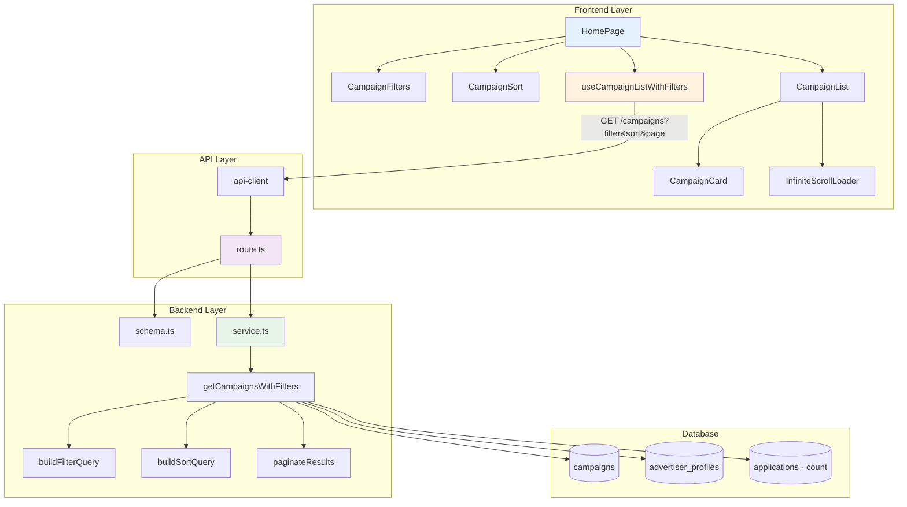

# UC-004: 홈 & 체험단 목록 탐색 - 구현 계획

## 개요

### 현재 상태 (Already Implemented)

| 모듈 | 위치 | 상태 |
|------|------|------|
| **getAllCampaigns** | `src/features/campaign/backend/service.ts` | ✅ 기본 목록 조회 구현됨 |
| **GET /campaigns** | `src/features/campaign/backend/route.ts` | ✅ 기본 API 구현됨 |
| **useCampaignList** | `src/features/campaign/hooks/useCampaign.ts` | ✅ 기본 훅 구현됨 |
| **CampaignList** | `src/features/campaign/components/CampaignList.tsx` | ✅ 기본 목록 UI 구현됨 |

### 추가 구현 필요 모듈

| 모듈 | 위치 | 설명 |
|------|------|------|
| **getCampaignsWithFilters** | `src/features/campaign/backend/service.ts` | 필터링 및 페이지네이션 로직 |
| **CampaignFilters** | `src/features/campaign/components/CampaignFilters.tsx` | 필터 UI (카테고리, 지역) |
| **CampaignSort** | `src/features/campaign/components/CampaignSort.tsx` | 정렬 UI |
| **InfiniteScrollLoader** | `src/components/shared/InfiniteScrollLoader.tsx` | 무한 스크롤 공통 컴포넌트 |
| **EmptyState** | `src/components/shared/EmptyState.tsx` | 빈 상태 UI |

### 공통 모듈 (Shared)

| 모듈 | 위치 | 설명 |
|------|------|------|
| **pagination.ts** | `src/lib/utils/pagination.ts` | 페이지네이션 유틸리티 |
| **query-builder.ts** | `src/backend/utils/query-builder.ts` | 동적 쿼리 빌더 |

---

## Diagram



---

## Implementation Plan

### 1️⃣ Backend Layer - Service Extensions

#### 1.1 Filtered Campaign List

**구현 내용**:
```typescript
type CampaignFilters = {
  category?: string;
  location?: string;
  sort?: 'latest' | 'deadline';
  page?: number;
  limit?: number;
};

type PaginatedCampaigns = {
  campaigns: CampaignListItem[];
  pagination: {
    page: number;
    limit: number;
    total: number;
    totalPages: number;
    hasMore: boolean;
  };
};

export const getCampaignsWithFilters = async (
  client: SupabaseClient,
  filters: CampaignFilters
): Promise<HandlerResult<PaginatedCampaigns, CampaignServiceError, unknown>> => {
  try {
    // 1. Base query
    let query = client
      .from('campaigns')
      .select(`
        id,
        title,
        location,
        recruit_count,
        recruit_end_date,
        status,
        advertiser_profiles!inner (
          company_name,
          category
        )
      `, { count: 'exact' })
      .eq('status', 'recruiting');

    // 2. Apply filters
    if (filters.category) {
      query = query.eq('advertiser_profiles.category', filters.category);
    }
    if (filters.location) {
      query = query.ilike('location', `%${filters.location}%`);
    }

    // 3. Apply sorting
    if (filters.sort === 'deadline') {
      query = query.order('recruit_end_date', { ascending: true });
    } else {
      query = query.order('created_at', { ascending: false });
    }

    // 4. Apply pagination
    const page = filters.page || 1;
    const limit = Math.min(filters.limit || 20, 50); // max 50
    const from = (page - 1) * limit;
    const to = from + limit - 1;
    
    query = query.range(from, to);

    // 5. Execute query
    const { data, error, count } = await query;

    if (error) {
      return failure(500, campaignErrorCodes.campaignFetchError, error.message);
    }

    // 6. Aggregate application counts
    const campaignIds = data.map(c => c.id);
    const { data: appCounts } = await client
      .from('applications')
      .select('campaign_id')
      .in('campaign_id', campaignIds);

    const countMap = appCounts.reduce((acc, app) => {
      acc[app.campaign_id] = (acc[app.campaign_id] || 0) + 1;
      return acc;
    }, {} as Record<string, number>);

    // 7. Build response
    const campaigns = data.map(c => ({
      ...c,
      applicationCount: countMap[c.id] || 0,
    }));

    const total = count || 0;
    const totalPages = Math.ceil(total / limit);

    return success({
      campaigns,
      pagination: {
        page,
        limit,
        total,
        totalPages,
        hasMore: page < totalPages,
      },
    });
  } catch (error) {
    return failure(500, campaignErrorCodes.campaignFetchError, error.message);
  }
};
```

**Unit Tests**:
```typescript
describe('getCampaignsWithFilters', () => {
  it('필터 없이 전체 목록을 반환한다', () => {});
  it('카테고리 필터를 적용한다', () => {});
  it('지역 필터를 적용한다 (부분 일치)', () => {});
  it('마감임박순 정렬을 적용한다', () => {});
  it('페이지네이션을 적용한다', () => {});
  it('지원자 수를 집계한다', () => {});
  it('hasMore 플래그를 올바르게 설정한다', () => {});
});
```

---

#### 1.2 Schema Extensions

**추가 스키마**:
```typescript
// Query parameters
export const CampaignFilterSchema = z.object({
  category: z.string().optional(),
  location: z.string().optional(),
  sort: z.enum(['latest', 'deadline']).default('latest'),
  page: z.coerce.number().int().min(1).default(1),
  limit: z.coerce.number().int().min(1).max(50).default(20),
});

export type CampaignFilter = z.infer<typeof CampaignFilterSchema>;

// Response
export const PaginationSchema = z.object({
  page: z.number(),
  limit: z.number(),
  total: z.number(),
  totalPages: z.number(),
  hasMore: z.boolean(),
});

export const CampaignListResponseSchema = z.object({
  campaigns: z.array(CampaignListItemSchema),
  pagination: PaginationSchema,
});
```

---

#### 1.3 Route Extensions

**수정 라우트**:
```typescript
app.get('/campaigns', async (c) => {
  const supabase = getSupabase(c);
  
  // Query parameters parsing
  const filters = {
    category: c.req.query('category'),
    location: c.req.query('location'),
    sort: c.req.query('sort') as 'latest' | 'deadline' | undefined,
    page: parseInt(c.req.query('page') || '1'),
    limit: parseInt(c.req.query('limit') || '20'),
  };

  const parsed = CampaignFilterSchema.safeParse(filters);
  
  if (!parsed.success) {
    return respond(c, failure(400, campaignErrorCodes.invalidRequest, '잘못된 필터 파라미터', parsed.error));
  }

  const result = await getCampaignsWithFilters(supabase, parsed.data);
  return respond(c, result);
});
```

---

### 2️⃣ Frontend Layer

#### 2.1 Campaign Filters Component

**구현 내용**:
```typescript
type CampaignFiltersProps = {
  filters: CampaignFilter;
  onChange: (filters: CampaignFilter) => void;
};

export function CampaignFilters({ filters, onChange }: CampaignFiltersProps) {
  const categories = ['음식점', '카페', '뷰티', '숙박', '기타'];
  
  const handleCategoryChange = (category: string) => {
    onChange({ ...filters, category, page: 1 });
  };

  const handleLocationChange = (location: string) => {
    onChange({ ...filters, location, page: 1 });
  };

  const handleReset = () => {
    onChange({ sort: 'latest', page: 1, limit: 20 });
  };

  return (
    <div className="flex gap-4">
      <Select value={filters.category} onValueChange={handleCategoryChange}>
        <SelectTrigger>
          <SelectValue placeholder="카테고리 선택" />
        </SelectTrigger>
        <SelectContent>
          {categories.map(cat => (
            <SelectItem key={cat} value={cat}>{cat}</SelectItem>
          ))}
        </SelectContent>
      </Select>

      <Input
        placeholder="지역 검색"
        value={filters.location || ''}
        onChange={(e) => handleLocationChange(e.target.value)}
      />

      <Button variant="outline" onClick={handleReset}>
        필터 초기화
      </Button>
    </div>
  );
}
```

**QA Sheet**:
```yaml
# 동작
- [ ] 카테고리 선택 시 필터 적용
- [ ] 지역 입력 시 디바운스 적용 (500ms)
- [ ] 필터 변경 시 page를 1로 리셋
- [ ] 필터 초기화 시 모든 필터 제거

# UI/UX
- [ ] 활성 필터 시각적 표시
- [ ] 모바일 반응형 (드롭다운으로 전환)
```

---

#### 2.2 Campaign Sort Component

**구현 내용**:
```typescript
type CampaignSortProps = {
  value: 'latest' | 'deadline';
  onChange: (sort: 'latest' | 'deadline') => void;
};

export function CampaignSort({ value, onChange }: CampaignSortProps) {
  return (
    <div className="flex gap-2">
      <Button
        variant={value === 'latest' ? 'default' : 'outline'}
        onClick={() => onChange('latest')}
      >
        최신순
      </Button>
      <Button
        variant={value === 'deadline' ? 'default' : 'outline'}
        onClick={() => onChange('deadline')}
      >
        마감임박순
      </Button>
    </div>
  );
}
```

---

#### 2.3 Infinite Scroll Hook

**구현 내용**:
```typescript
export const useCampaignListWithInfiniteScroll = (initialFilters: CampaignFilter) => {
  const [filters, setFilters] = useState(initialFilters);

  return useInfiniteQuery({
    queryKey: ['campaigns', filters],
    queryFn: async ({ pageParam = 1 }) => {
      const response = await apiClient.get('/campaigns', {
        params: { ...filters, page: pageParam },
      });
      return response.data;
    },
    getNextPageParam: (lastPage) => {
      return lastPage.pagination.hasMore ? lastPage.pagination.page + 1 : undefined;
    },
  });
};

// Usage in component
const { data, fetchNextPage, hasNextPage, isFetchingNextPage } = useCampaignListWithInfiniteScroll(filters);

const allCampaigns = data?.pages.flatMap(page => page.campaigns) ?? [];
```

**QA Sheet**:
```yaml
# 동작
- [ ] 스크롤 하단 도달 시 다음 페이지 로드
- [ ] 필터 변경 시 데이터 리셋
- [ ] 로딩 중 중복 요청 방지

# UI/UX
- [ ] 로딩 스피너 표시
- [ ] "더 이상 없습니다" 메시지
```

---

#### 2.4 Empty State Component

**구현 내용**:
```typescript
type EmptyStateProps = {
  message: string;
  action?: {
    label: string;
    onClick: () => void;
  };
};

export function EmptyState({ message, action }: EmptyStateProps) {
  return (
    <div className="flex flex-col items-center justify-center py-16">
      <p className="text-muted-foreground mb-4">{message}</p>
      {action && (
        <Button onClick={action.onClick}>{action.label}</Button>
      )}
    </div>
  );
}
```

---

### 3️⃣ Integration

#### 3.1 HomePage Update

**구현 내용**:
```typescript
export default function HomePage() {
  const [filters, setFilters] = useState<CampaignFilter>({
    sort: 'latest',
    page: 1,
    limit: 20,
  });

  const { data, fetchNextPage, hasNextPage, isFetchingNextPage, isLoading } = 
    useCampaignListWithInfiniteScroll(filters);

  const allCampaigns = data?.pages.flatMap(page => page.campaigns) ?? [];

  return (
    <div>
      <header>
        <h1>모집 중인 체험단</h1>
        <CampaignSort value={filters.sort} onChange={(sort) => setFilters({ ...filters, sort, page: 1 })} />
      </header>

      <CampaignFilters filters={filters} onChange={setFilters} />

      {isLoading ? (
        <SkeletonList count={6} />
      ) : allCampaigns.length === 0 ? (
        <EmptyState
          message="현재 모집 중인 체험단이 없습니다"
          action={{ label: '홈으로 이동', onClick: () => {} }}
        />
      ) : (
        <>
          <CampaignList campaigns={allCampaigns} />
          {hasNextPage && (
            <InfiniteScrollLoader
              onIntersect={fetchNextPage}
              isLoading={isFetchingNextPage}
            />
          )}
        </>
      )}
    </div>
  );
}
```

---

## 구현 순서

### Phase 1: Backend Extensions
1. ✅ Schema에 filter/pagination 파라미터 추가
2. ✅ getCampaignsWithFilters 구현
3. ✅ Route 수정

### Phase 2: Frontend Components
4. ✅ CampaignFilters 구현
5. ✅ CampaignSort 구현
6. ✅ InfiniteScrollLoader 구현 (Shared)
7. ✅ EmptyState 구현 (Shared)

### Phase 3: Hooks & Integration
8. ✅ useInfiniteQuery 훅 구현
9. ✅ HomePage 통합

### Phase 4: Testing
10. ✅ E2E 시나리오 테스트

---

## 테스트 전략

### Unit Tests
- ✅ Filter query building
- ✅ Pagination calculation
- ✅ Application count aggregation

### Integration Tests
- ✅ GET /campaigns with filters
- ✅ Pagination hasMore flag

### E2E Tests
- ✅ 필터 적용 → 결과 변경
- ✅ 무한 스크롤 → 다음 페이지 로드
- ✅ 빈 결과 → EmptyState 표시

---

## Dependencies

### 새로운 shadcn-ui 컴포넌트 필요
```bash
$ npx shadcn@latest add select
```

### 기존 라이브러리 활용
- ✅ @tanstack/react-query (useInfiniteQuery)
- ✅ react-intersection-observer (무한 스크롤)

---

## 성능 고려사항

1. **지원자 수 집계**: 별도 쿼리로 최적화
2. **캐싱**: React Query 5분 캐싱
3. **디바운스**: 지역 검색 500ms 디바운스

---

## 향후 개선사항

1. 검색 기능 (제목, 설명)
2. 즐겨찾기 기능
3. 최근 본 체험단

