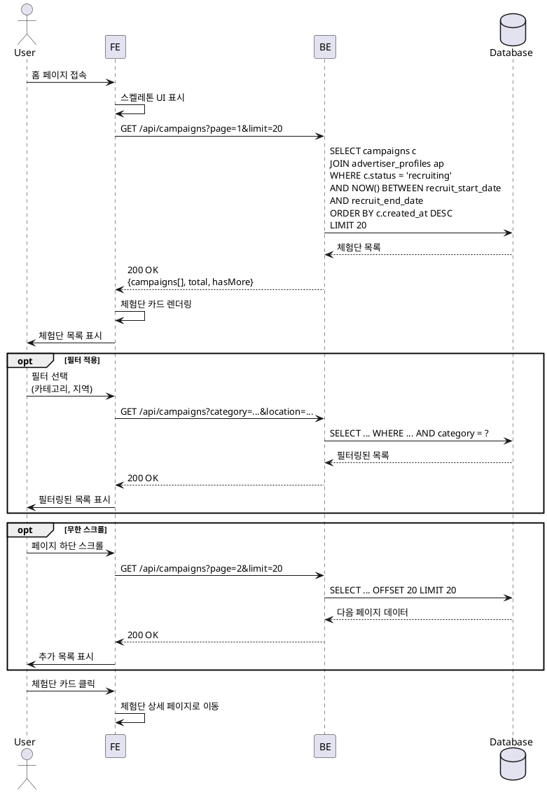

# UC-004: 홈 & 체험단 목록 탐색

## Primary Actor
- 모든 사용자 (로그인 여부 무관)

## Precondition
- 없음 (홈 페이지는 누구나 접근 가능)

## Trigger
- 메인 페이지 접속
- 네비게이션 바에서 "홈" 클릭

## Main Scenario

1. 사용자가 홈 페이지 접속

2. 시스템이 모집 중인 체험단 목록 조회
   - status = 'recruiting'
   - 현재 시간이 recruit_start_date와 recruit_end_date 사이

3. 시스템이 체험단 카드 리스트 렌더링
   - 썸네일 이미지 (또는 플레이스홀더)
   - 체험단 제목
   - 업체명
   - 위치
   - 모집 인원
   - 모집 마감일

4. 사용자가 필터/정렬 옵션 선택 (선택사항)
   - 카테고리 필터
   - 지역 필터
   - 정렬 (최신순, 마감임박순)

5. 시스템이 필터링된 목록 재조회 및 표시

6. 사용자가 페이지 스크롤 (무한 스크롤 또는 페이지네이션)

7. 시스템이 추가 데이터 로드

8. 사용자가 관심있는 체험단 카드 클릭

9. 시스템이 체험단 상세 페이지로 이동

## Edge Cases

### 모집 중인 체험단 없음
- **발생**: 현재 모집 중인 체험단이 하나도 없음
- **처리**: "현재 모집 중인 체험단이 없습니다" 안내 메시지 표시

### 필터 결과 없음
- **발생**: 선택한 필터 조건에 맞는 체험단 없음
- **처리**: "조건에 맞는 체험단이 없습니다. 필터를 변경해보세요" 메시지 표시

### 네트워크 오류
- **발생**: API 요청 실패
- **처리**: "데이터를 불러오는 중 오류가 발생했습니다" 에러 메시지, 재시도 버튼 제공

### 느린 로딩
- **발생**: 데이터 로딩이 오래 걸림
- **처리**: 스켈레톤 UI 표시

### 이미지 로드 실패
- **발생**: 썸네일 이미지 로드 실패
- **처리**: 기본 플레이스홀더 이미지 표시

## Business Rules

### BR-001: 모집 중 체험단 표시
- status = 'recruiting'이고 현재 시간이 모집 기간 내인 체험단만 표시

### BR-002: 정렬 기본값
- 기본 정렬은 최신 등록순 (created_at DESC)

### BR-003: 페이징
- 한 번에 20개씩 로드 (무한 스크롤 또는 페이지네이션)

### BR-004: 캐싱
- 체험단 목록은 5분간 캐싱하여 성능 최적화

### BR-005: 공개 접근
- 로그인하지 않은 사용자도 목록 조회 가능
- 지원하기는 로그인 필요

## Sequence Diagram



## API Endpoints

### GET `/api/campaigns`
체험단 목록 조회

### Query Parameters
```typescript
{
  page?: number; // 기본값: 1
  limit?: number; // 기본값: 20, 최대: 50
  category?: string; // 카테고리 필터
  location?: string; // 지역 필터
  sort?: 'latest' | 'deadline'; // 정렬 (최신순, 마감임박순)
}
```

### Response (200 OK)
```typescript
{
  campaigns: Array<{
    id: string;
    title: string;
    location: string;
    recruitCount: number;
    recruitEndDate: string;
    thumbnailUrl: string | null;
    advertiser: {
      companyName: string;
      category: string;
    };
    stats: {
      applicationCount: number; // 지원자 수
    };
  }>;
  pagination: {
    page: number;
    limit: number;
    total: number;
    hasMore: boolean;
  };
}
```

### Error Responses
- `400 Bad Request`: 잘못된 쿼리 파라미터
- `500 Internal Server Error`: 서버 오류

