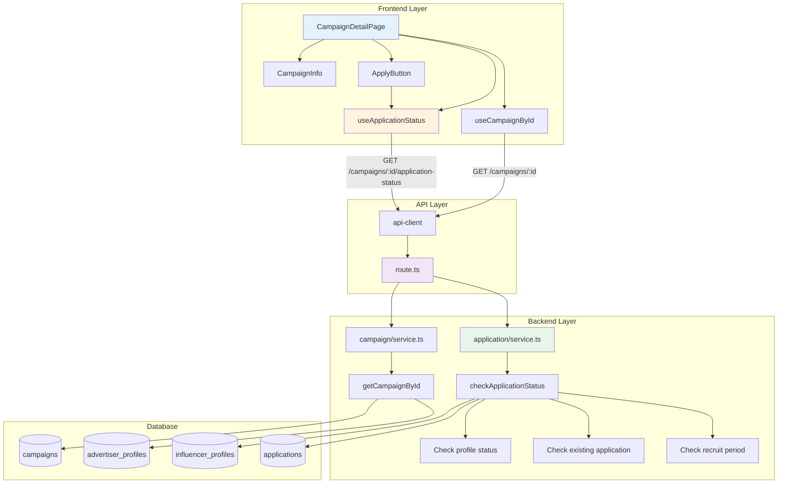

# UC-005: 체험단 상세 - 구현 계획

## 개요

### 현재 상태 (Already Implemented)

| 모듈 | 위치 | 상태 |
|------|------|------|
| **getCampaignById** | `src/features/campaign/backend/service.ts` | ✅ 기본 조회 로직 구현됨 |
| **GET /campaigns/:id** | `src/features/campaign/backend/route.ts` | ✅ 기본 API 구현됨 |
| **useCampaignById** | `src/features/campaign/hooks/useCampaign.ts` | ✅ 기본 훅 구현됨 |
| **/campaigns/[id]/page.tsx** | `src/app/campaigns/[id]/page.tsx` | ✅ 기본 페이지 구현됨 |

### 추가 구현 필요 모듈

| 모듈 | 위치 | 설명 |
|------|------|------|
| **checkApplicationStatus** | `src/features/application/backend/service.ts` | 지원 가능 여부 체크 |
| **GET /campaigns/:id/application-status** | `src/features/application/backend/route.ts` | 지원 상태 조회 API |
| **ApplyButton** | `src/features/campaign/components/ApplyButton.tsx` | 동적 지원 버튼 |
| **CampaignDetailSections** | `src/features/campaign/components/CampaignDetailSections.tsx` | 정보 섹션 컴포넌트 |

### 공통 모듈 (Shared)

| 모듈 | 위치 | 설명 |
|------|------|------|
| **NotFoundPage** | `src/app/not-found.tsx` | 404 페이지 (Next.js 기본) |
| **profile-guard.ts** | `src/lib/guards/profile.ts` | 프로필 상태 체크 유틸 |

---

## Diagram



---

## Implementation Plan

### 1️⃣ Backend Layer - Application Status Check

#### 1.1 Check Application Status Service

**구현 내용**:
```typescript
type ApplicationStatusResult = {
  canApply: boolean;
  hasApplied: boolean;
  reason?: 'not_logged_in' | 'profile_not_approved' | 'already_applied' | 'recruit_ended' | 'wrong_role';
  profileStatus?: 'draft' | 'pending' | 'approved' | 'rejected';
};

export const checkApplicationStatus = async (
  client: SupabaseClient,
  userId: string | undefined,
  campaignId: string
): Promise<HandlerResult<ApplicationStatusResult, ApplicationServiceError, unknown>> => {
  try {
    // 1. Check if user is logged in
    if (!userId) {
      return success({
        canApply: false,
        hasApplied: false,
        reason: 'not_logged_in',
      });
    }

    // 2. Get user role
    const { data: user } = await client
      .from('users')
      .select('role')
      .eq('id', userId)
      .single();

    if (!user || user.role !== 'influencer') {
      return success({
        canApply: false,
        hasApplied: false,
        reason: 'wrong_role',
      });
    }

    // 3. Check influencer profile status
    const { data: profile } = await client
      .from('influencer_profiles')
      .select('id, profile_status')
      .eq('user_id', userId)
      .maybeSingle();

    if (!profile || profile.profile_status !== 'approved') {
      return success({
        canApply: false,
        hasApplied: false,
        reason: 'profile_not_approved',
        profileStatus: profile?.profile_status,
      });
    }

    // 4. Check existing application
    const { data: application } = await client
      .from('applications')
      .select('id')
      .eq('campaign_id', campaignId)
      .eq('influencer_profile_id', profile.id)
      .maybeSingle();

    if (application) {
      return success({
        canApply: false,
        hasApplied: true,
        reason: 'already_applied',
      });
    }

    // 5. Check campaign status and period
    const { data: campaign } = await client
      .from('campaigns')
      .select('status, recruit_start_date, recruit_end_date')
      .eq('id', campaignId)
      .single();

    if (!campaign || campaign.status !== 'recruiting') {
      return success({
        canApply: false,
        hasApplied: false,
        reason: 'recruit_ended',
      });
    }

    const now = new Date();
    const startDate = new Date(campaign.recruit_start_date);
    const endDate = new Date(campaign.recruit_end_date);

    if (now < startDate || now > endDate) {
      return success({
        canApply: false,
        hasApplied: false,
        reason: 'recruit_ended',
      });
    }

    // 6. All checks passed
    return success({
      canApply: true,
      hasApplied: false,
    });
  } catch (error) {
    return failure(500, applicationErrorCodes.applicationStatusCheckError, error.message);
  }
};
```

**Unit Tests**:
```typescript
describe('checkApplicationStatus', () => {
  it('비로그인 사용자는 not_logged_in을 반환한다', () => {});
  it('광고주는 wrong_role을 반환한다', () => {});
  it('프로필 미승인 인플루언서는 profile_not_approved를 반환한다', () => {});
  it('이미 지원한 경우 already_applied를 반환한다', () => {});
  it('모집 기간 외에는 recruit_ended를 반환한다', () => {});
  it('모든 조건 만족 시 canApply: true를 반환한다', () => {});
});
```

---

#### 1.2 Schema Extensions

**추가 스키마**:
```typescript
export const ApplicationStatusResponseSchema = z.object({
  canApply: z.boolean(),
  hasApplied: z.boolean(),
  reason: z.enum(['not_logged_in', 'profile_not_approved', 'already_applied', 'recruit_ended', 'wrong_role']).optional(),
  profileStatus: z.enum(['draft', 'pending', 'approved', 'rejected']).optional(),
});

export type ApplicationStatusResponse = z.infer<typeof ApplicationStatusResponseSchema>;
```

---

#### 1.3 Route Extensions

**추가 라우트**:
```typescript
// application/backend/route.ts에 추가
app.get('/campaigns/:id/application-status', async (c) => {
  const supabase = getSupabase(c);
  const campaignId = c.req.param('id');

  const { data: authData } = await supabase.auth.getUser();
  const userId = authData.user?.id;

  const result = await checkApplicationStatus(supabase, userId, campaignId);
  return respond(c, result);
});
```

**Unit Tests**:
```typescript
describe('GET /campaigns/:id/application-status', () => {
  it('로그인 사용자는 상세 상태를 반환한다', () => {});
  it('비로그인 사용자는 not_logged_in을 반환한다', () => {});
  it('존재하지 않는 캠페인은 404를 반환한다', () => {});
});
```

---

### 2️⃣ Frontend Layer

#### 2.1 Apply Button Component

**구현 내용**:
```typescript
type ApplyButtonProps = {
  campaignId: string;
  campaignTitle: string;
};

export function ApplyButton({ campaignId, campaignTitle }: ApplyButtonProps) {
  const router = useRouter();
  const { user } = useCurrentUser();
  const { data: status, isLoading } = useApplicationStatus(campaignId);

  if (isLoading) {
    return <Button disabled>확인 중...</Button>;
  }

  if (!user) {
    return (
      <Button onClick={() => router.push(`/login?redirect=/campaigns/${campaignId}`)}>
        로그인하고 지원하기
      </Button>
    );
  }

  if (status?.hasApplied) {
    return (
      <Button disabled variant="secondary">
        지원 완료
      </Button>
    );
  }

  if (!status?.canApply) {
    switch (status?.reason) {
      case 'profile_not_approved':
        return (
          <div className="space-y-2">
            <Button disabled>프로필 승인 후 지원 가능</Button>
            <p className="text-sm text-muted-foreground">
              현재 프로필 상태: {status.profileStatus === 'pending' ? '검증 대기' : '등록 필요'}
            </p>
            <Button variant="outline" onClick={() => router.push('/onboarding/influencer')}>
              프로필 등록하기
            </Button>
          </div>
        );
      case 'recruit_ended':
        return <Button disabled>모집 마감</Button>;
      case 'wrong_role':
        return <Button disabled>인플루언서만 지원 가능</Button>;
      default:
        return <Button disabled>지원 불가</Button>;
    }
  }

  return (
    <Button onClick={() => router.push(`/campaigns/${campaignId}/apply`)}>
      지원하기
    </Button>
  );
}
```

**QA Sheet**:
```yaml
# 동작
- [ ] 로그인하지 않은 사용자 → "로그인하고 지원하기"
- [ ] 프로필 미승인 → "프로필 승인 후 지원 가능" + 프로필 등록 링크
- [ ] 이미 지원 → "지원 완료" (비활성화)
- [ ] 모집 마감 → "모집 마감" (비활성화)
- [ ] 지원 가능 → "지원하기" (활성화)

# UI/UX
- [ ] 버튼 상태별 색상 구분
- [ ] 추가 안내 메시지 명확
```

---

#### 2.2 Application Status Hook

**구현 내용**:
```typescript
export const useApplicationStatus = (campaignId: string) => {
  return useQuery({
    queryKey: ['application-status', campaignId],
    queryFn: async () => {
      const response = await apiClient.get(`/campaigns/${campaignId}/application-status`);
      return ApplicationStatusResponseSchema.parse(response.data);
    },
    enabled: !!campaignId,
  });
};
```

---

#### 2.3 Campaign Detail Page Enhancement

**구현 내용**:
```typescript
export default async function CampaignDetailPage({ params }: CampaignDetailPageProps) {
  const { id } = await params;

  return (
    <div className="container mx-auto px-6 py-12">
      <CampaignDetailContent campaignId={id} />
    </div>
  );
}

function CampaignDetailContent({ campaignId }: { campaignId: string }) {
  const { data: campaign, isLoading, error } = useCampaignById(campaignId);

  if (isLoading) return <SkeletonDetail />;
  if (error) return <NotFoundPage />;
  if (!campaign) return <NotFoundPage />;

  return (
    <div className="grid grid-cols-1 lg:grid-cols-3 gap-8">
      {/* Main Content */}
      <div className="lg:col-span-2 space-y-8">
        <header>
          <h1 className="text-3xl font-bold">{campaign.title}</h1>
          <div className="flex items-center gap-4 mt-2 text-muted-foreground">
            <span>{campaign.advertiser.companyName}</span>
            <Separator orientation="vertical" className="h-4" />
            <span>{campaign.location}</span>
          </div>
        </header>

        <CampaignDetailSections campaign={campaign} />
      </div>

      {/* Sidebar */}
      <aside className="space-y-6">
        <Card>
          <CardHeader>
            <CardTitle>모집 정보</CardTitle>
          </CardHeader>
          <CardContent className="space-y-4">
            <div>
              <p className="text-sm text-muted-foreground">모집 인원</p>
              <p className="text-lg font-semibold">{campaign.recruitCount}명</p>
            </div>
            <div>
              <p className="text-sm text-muted-foreground">모집 마감일</p>
              <p className="text-lg font-semibold">
                {format(new Date(campaign.recruitEndDate), 'yyyy-MM-dd')}
              </p>
            </div>
            <div>
              <p className="text-sm text-muted-foreground">체험 기간</p>
              <p>
                {format(new Date(campaign.experienceStartDate), 'yyyy-MM-dd')} ~{' '}
                {format(new Date(campaign.experienceEndDate), 'yyyy-MM-dd')}
              </p>
            </div>

            <Separator />

            <ApplyButton campaignId={campaignId} campaignTitle={campaign.title} />
          </CardContent>
        </Card>
      </aside>
    </div>
  );
}
```

---

#### 2.4 Campaign Detail Sections

**구현 내용**:
```typescript
type CampaignDetailSectionsProps = {
  campaign: CampaignResponse;
};

export function CampaignDetailSections({ campaign }: CampaignDetailSectionsProps) {
  return (
    <div className="space-y-6">
      <Section title="설명">
        <p className="whitespace-pre-wrap">{campaign.description}</p>
      </Section>

      <Section title="혜택">
        <p className="whitespace-pre-wrap">{campaign.benefits}</p>
      </Section>

      <Section title="미션">
        <p className="whitespace-pre-wrap">{campaign.mission}</p>
      </Section>

      <Section title="위치">
        <p>{campaign.location}</p>
        {/* TODO: 지도 컴포넌트 추가 */}
      </Section>
    </div>
  );
}

function Section({ title, children }: { title: string; children: React.ReactNode }) {
  return (
    <Card>
      <CardHeader>
        <CardTitle>{title}</CardTitle>
      </CardHeader>
      <CardContent>{children}</CardContent>
    </Card>
  );
}
```

---

### 3️⃣ Integration

#### 3.1 Error Codes Extension

**추가 에러 코드**:
```typescript
export const applicationErrorCodes = {
  // ... 기존 코드 ...
  applicationStatusCheckError: 'APPLICATION_STATUS_CHECK_ERROR',
} as const;
```

---

## 구현 순서

### Phase 1: Backend Extensions
1. ✅ checkApplicationStatus 서비스 구현
2. ✅ Schema 추가
3. ✅ Route 추가

### Phase 2: Frontend Components
4. ✅ useApplicationStatus 훅 구현
5. ✅ ApplyButton 컴포넌트 구현
6. ✅ CampaignDetailSections 구현
7. ✅ CampaignDetailPage 개선

### Phase 3: Testing
8. ✅ E2E 시나리오 테스트

---

## 테스트 전략

### Unit Tests
- ✅ checkApplicationStatus (모든 케이스)

### Integration Tests
- ✅ GET /campaigns/:id/application-status

### E2E Tests
- ✅ 비로그인 → "로그인하고 지원하기"
- ✅ 프로필 미승인 → 안내 메시지
- ✅ 이미 지원 → "지원 완료"
- ✅ 지원 가능 → "지원하기" 활성화

---

## Dependencies

### 기존 shadcn-ui 컴포넌트 활용
- ✅ Card, Button, Separator

### 기존 라이브러리 활용
- ✅ date-fns (날짜 포맷)
- ✅ @tanstack/react-query

---

## 향후 개선사항

1. 지도 컴포넌트 (Kakao/Naver Map)
2. 이미지 갤러리
3. 공유 기능
4. 즐겨찾기

