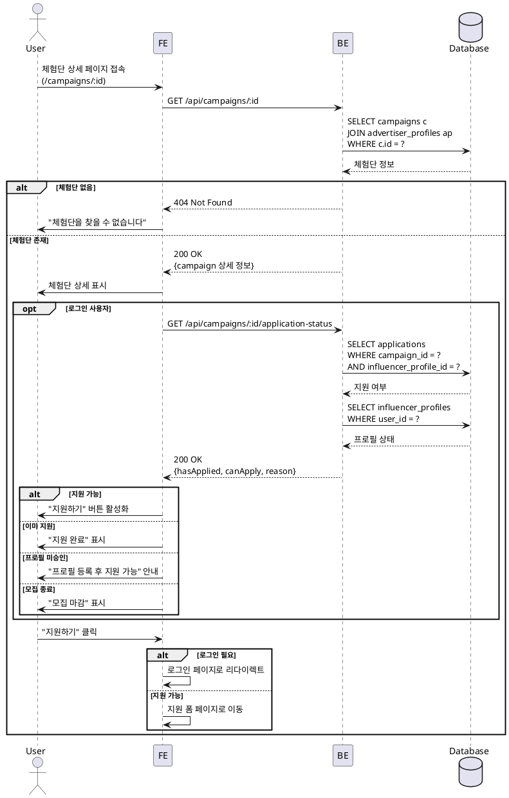

# UC-005: 체험단 상세

## Primary Actor
- 모든 사용자 (로그인 여부 무관, 지원은 인플루언서만)

## Precondition
- 체험단이 존재함
- 체험단이 삭제되지 않음

## Trigger
- 홈 페이지에서 체험단 카드 클릭
- 직접 URL 접근

## Main Scenario

1. 사용자가 체험단 상세 페이지 접속

2. 시스템이 체험단 정보 조회
   - 기본 정보 (제목, 설명, 위치)
   - 혜택
   - 미션
   - 모집 정보 (인원, 기간)
   - 체험 기간
   - 광고주 정보

3. 시스템이 사용자 권한 체크
   - 로그인 여부
   - 역할 (인플루언서 여부)
   - 인플루언서 프로필 승인 상태

4. 시스템이 지원 가능 여부 판단
   - 모집 기간 내인지
   - 이미 지원했는지
   - 인플루언서 프로필이 승인되었는지

5. 시스템이 상세 정보 렌더링
   - 이미지 (있는 경우)
   - 모든 정보 섹션별 표시
   - 지도 (위치 정보)

6. 시스템이 지원 버튼 상태 결정
   - 지원 가능: "지원하기" 활성화
   - 로그인 필요: "로그인하고 지원하기"
   - 프로필 미승인: "프로필 등록 후 지원 가능"
   - 이미 지원: "지원 완료" (비활성화)
   - 모집 종료: "모집 마감" (비활성화)

7. 사용자가 "지원하기" 버튼 클릭

8. 시스템이 체험단 지원 폼으로 이동

## Edge Cases

### 존재하지 않는 체험단
- **발생**: 삭제되었거나 잘못된 ID로 접근
- **처리**: 404 페이지 표시, "체험단을 찾을 수 없습니다"

### 취소된 체험단
- **발생**: status = 'cancelled'
- **처리**: "이 체험단은 취소되었습니다" 안내 메시지, 지원 버튼 숨김

### 비로그인 사용자가 지원 시도
- **발생**: 로그인하지 않은 상태에서 "지원하기" 클릭
- **처리**: 로그인 페이지로 리다이렉트, 로그인 후 다시 돌아옴

### 광고주가 지원 시도
- **발생**: 광고주 역할 사용자가 지원 시도
- **처리**: "인플루언서만 지원 가능합니다" 에러 메시지

### 프로필 미승인 인플루언서
- **발생**: profile_status != 'approved'
- **처리**: "프로필 승인 후 지원 가능합니다" 안내, 프로필 페이지 링크 제공

### 중복 지원 시도
- **발생**: 이미 지원한 체험단에 다시 지원
- **처리**: "이미 지원한 체험단입니다" 메시지, 내 지원 목록 링크 제공

### 모집 기간 종료
- **발생**: 현재 시간 > recruit_end_date
- **처리**: "모집이 마감되었습니다" 표시, 지원 버튼 비활성화

## Business Rules

### BR-001: 지원 자격
- 인플루언서 역할이고 profile_status = 'approved'인 경우만 지원 가능

### BR-002: 모집 기간 확인
- 현재 시간이 recruit_start_date와 recruit_end_date 사이일 때만 지원 가능

### BR-003: 중복 지원 방지
- 한 체험단에 한 번만 지원 가능

### BR-004: 공개 조회
- 모든 사용자가 체험단 상세 정보 조회 가능
- 지원만 권한 필요

### BR-005: 지원자 수 표시
- 현재 지원자 수 표시 (선택적)

## Sequence Diagram



## API Endpoints

### GET `/api/campaigns/:id`
체험단 상세 정보 조회

### Response (200 OK)
```typescript
{
  campaign: {
    id: string;
    title: string;
    description: string;
    location: string;
    benefits: string;
    mission: string;
    recruitCount: number;
    recruitStartDate: string;
    recruitEndDate: string;
    experienceStartDate: string;
    experienceEndDate: string;
    status: 'recruiting' | 'recruit_ended' | 'selection_completed' | 'cancelled';
    advertiser: {
      companyName: string;
      category: string;
    };
    stats: {
      applicationCount: number;
    };
  };
}
```

### GET `/api/campaigns/:id/application-status`
지원 가능 여부 확인 (로그인 필요)

### Response (200 OK)
```typescript
{
  canApply: boolean;
  hasApplied: boolean;
  reason?: 'not_logged_in' | 'profile_not_approved' | 'already_applied' | 'recruit_ended' | 'wrong_role';
}
```

### Error Responses
- `404 Not Found`: 체험단 없음
- `500 Internal Server Error`: 서버 오류

