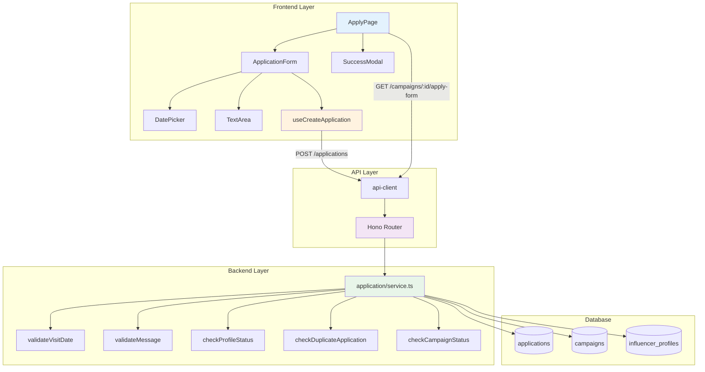

# UC-006: 체험단 지원 - 구현 계획

## 개요

### 현재 상태 (Already Implemented)

| 모듈 | 위치 | 상태 |
|------|------|------|
| **createApplication** | `src/features/application/backend/service.ts` | ✅ 기본 생성 로직 구현됨 |
| **POST /applications** | `src/features/application/backend/route.ts` | ✅ 기본 API 구현됨 |
| **useCreateApplication** | `src/features/application/hooks/useApplication.ts` | ✅ 기본 훅 구현됨 |
| **ApplicationForm** | `src/features/application/components/ApplicationForm.tsx` | ✅ 기본 폼 구현됨 |
| **/campaigns/[id]/apply/page.tsx** | `src/app/campaigns/[id]/apply/page.tsx` | ✅ 기본 페이지 구현됨 |

### 추가 구현 필요 모듈

| 모듈 | 위치 | 설명 |
|------|------|------|
| **validateVisitDate** | `src/features/application/backend/service.ts` | 방문 예정일자 체험 기간 검증 |
| **validateMessage** | `src/lib/validation/text.ts` | 각오 한마디 길이 검증 |
| **GET /campaigns/:id/apply-form** | `src/features/campaign/backend/route.ts` | 지원 폼 정보 조회 API |
| **SuccessModal** | `src/features/application/components/SuccessModal.tsx` | 지원 성공 모달 |

### 공통 모듈 (Shared)

| 모듈 | 위치 | 설명 |
|------|------|------|
| **text-validation.ts** | `src/lib/validation/text.ts` | 텍스트 길이 검증 유틸 |
| **date-validation.ts** | `src/lib/validation/date.ts` | 날짜 범위 검증 유틸 |

---

## Diagram



---

## Implementation Plan

### 1️⃣ Backend Layer - Validation Extensions

#### 1.1 Visit Date Validation

**구현 내용**:
```typescript
// application/backend/service.ts에 추가
const validateVisitDate = (
  visitDate: string,
  experienceStartDate: string,
  experienceEndDate: string
): { valid: boolean; message?: string } => {
  const visit = new Date(visitDate);
  const start = new Date(experienceStartDate);
  const end = new Date(experienceEndDate);

  if (visit < start || visit > end) {
    return {
      valid: false,
      message: `방문 예정일자는 체험 기간(${experienceStartDate} ~ ${experienceEndDate}) 내로 선택해주세요`,
    };
  }

  return { valid: true };
};

// createApplication에 통합
export const createApplication = async (
  client: SupabaseClient,
  userId: string,
  data: ApplicationCreateRequest
): Promise<HandlerResult<ApplicationResponse, ApplicationServiceError, unknown>> => {
  // ... 기존 검증 로직 ...

  // 체험단 정보 조회 (기간 포함)
  const { data: campaign } = await client
    .from('campaigns')
    .select('id, status, experience_start_date, experience_end_date')
    .eq('id', data.campaignId)
    .maybeSingle();

  if (!campaign) {
    return failure(404, applicationErrorCodes.campaignNotFound, '체험단을 찾을 수 없습니다');
  }

  // 방문 예정일자 검증
  const visitValidation = validateVisitDate(
    data.visitDate,
    campaign.experience_start_date,
    campaign.experience_end_date
  );

  if (!visitValidation.valid) {
    return failure(400, applicationErrorCodes.invalidVisitDate, visitValidation.message);
  }

  // ... 나머지 로직 ...
};
```

**Unit Tests**:
```typescript
describe('validateVisitDate', () => {
  it('체험 기간 내 날짜는 valid: true를 반환한다', () => {});
  it('체험 기간 이전 날짜는 valid: false를 반환한다', () => {});
  it('체험 기간 이후 날짜는 valid: false를 반환한다', () => {});
});
```

---

#### 1.2 Message Validation

**구현 내용**:
```typescript
// lib/validation/text.ts
export const validateTextLength = (
  text: string,
  min: number,
  max: number,
  fieldName: string = '텍스트'
): { valid: boolean; message?: string } => {
  const length = text.trim().length;

  if (length < min) {
    return {
      valid: false,
      message: `${fieldName}는 최소 ${min}자 이상 입력해주세요 (현재: ${length}자)`,
    };
  }

  if (length > max) {
    return {
      valid: false,
      message: `${fieldName}는 최대 ${max}자까지 입력 가능합니다 (현재: ${length}자)`,
    };
  }

  return { valid: true };
};

// application/backend/schema.ts에 추가
export const ApplicationCreateSchema = z.object({
  campaignId: z.string().uuid(),
  message: z
    .string()
    .min(10, '각오 한마디는 최소 10자 이상 입력해주세요')
    .max(500, '각오 한마디는 최대 500자까지 입력 가능합니다'),
  visitDate: z.string().regex(/^\d{4}-\d{2}-\d{2}$/, '올바른 날짜 형식이 아닙니다'),
});
```

---

#### 1.3 Apply Form Info API

**구현 내용**:
```typescript
// campaign/backend/route.ts에 추가
app.get('/campaigns/:id/apply-form', async (c) => {
  const supabase = getSupabase(c);
  const campaignId = c.req.param('id');

  const { data: campaign, error } = await supabase
    .from('campaigns')
    .select('id, title, recruit_count, recruit_end_date, experience_start_date, experience_end_date')
    .eq('id', campaignId)
    .single();

  if (error || !campaign) {
    return respond(c, failure(404, campaignErrorCodes.campaignNotFound, '체험단을 찾을 수 없습니다'));
  }

  return respond(c, success(campaign));
});
```

---

### 2️⃣ Frontend Layer

#### 2.1 Application Form Enhancement

**구현 내용**:
```typescript
export function ApplicationForm({ campaignId, campaignTitle }: ApplicationFormProps) {
  const router = useRouter();
  const { mutate: createApplication, isLoading } = useCreateApplication();

  // 체험단 정보 조회 (날짜 범위)
  const { data: campaignInfo } = useQuery({
    queryKey: ['campaign-apply-form', campaignId],
    queryFn: async () => {
      const response = await apiClient.get(`/campaigns/${campaignId}/apply-form`);
      return response.data;
    },
  });

  const form = useForm<ApplicationCreateRequest>({
    resolver: zodResolver(ApplicationCreateSchema),
    defaultValues: {
      campaignId,
      message: '',
      visitDate: '',
    },
  });

  const onSubmit = (data: ApplicationCreateRequest) => {
    createApplication(data, {
      onSuccess: () => {
        toast.success('지원이 완료되었습니다!');
        router.push('/my/applications');
      },
      onError: (error) => {
        toast.error(error.response?.data?.error?.message || '지원에 실패했습니다');
      },
    });
  };

  if (!campaignInfo) return <div>로딩 중...</div>;

  return (
    <Form {...form}>
      <form onSubmit={form.handleSubmit(onSubmit)} className="space-y-6">
        <Card>
          <CardHeader>
            <CardTitle>{campaignTitle}</CardTitle>
            <CardDescription>
              모집 인원: {campaignInfo.recruit_count}명 | 
              모집 마감: {format(new Date(campaignInfo.recruit_end_date), 'yyyy-MM-dd')}
            </CardDescription>
          </CardHeader>
          <CardContent className="space-y-6">
            {/* 각오 한마디 */}
            <FormField
              control={form.control}
              name="message"
              render={({ field }) => (
                <FormItem>
                  <FormLabel>각오 한마디 *</FormLabel>
                  <FormControl>
                    <Textarea
                      {...field}
                      placeholder="지원 동기와 각오를 작성해주세요"
                      rows={5}
                      maxLength={500}
                    />
                  </FormControl>
                  <FormDescription>
                    {field.value.length} / 500자 (최소 10자)
                  </FormDescription>
                  <FormMessage />
                </FormItem>
              )}
            />

            {/* 방문 예정일자 */}
            <FormField
              control={form.control}
              name="visitDate"
              render={({ field }) => (
                <FormItem>
                  <FormLabel>방문 예정일자 *</FormLabel>
                  <FormControl>
                    <Input
                      {...field}
                      type="date"
                      min={campaignInfo.experience_start_date}
                      max={campaignInfo.experience_end_date}
                    />
                  </FormControl>
                  <FormDescription>
                    체험 기간: {campaignInfo.experience_start_date} ~ {campaignInfo.experience_end_date}
                  </FormDescription>
                  <FormMessage />
                </FormItem>
              )}
            />

            <Button type="submit" className="w-full" disabled={isLoading}>
              {isLoading ? '제출 중...' : '제출하기'}
            </Button>
          </CardContent>
        </Card>
      </form>
    </Form>
  );
}
```

**QA Sheet**:
```yaml
# 동작
- [ ] 각오 한마디 10자 미만 제출 → 에러
- [ ] 방문 예정일자 미선택 → 에러
- [ ] 체험 기간 외 날짜 선택 불가 (date input min/max)
- [ ] 제출 성공 → 내 지원 목록으로 이동
- [ ] 중복 지원 시도 → 409 에러

# UI/UX
- [ ] 글자 수 실시간 표시
- [ ] 제출 중 버튼 비활성화 및 로딩 표시
- [ ] 성공 토스트 메시지
- [ ] 에러 메시지 명확
```

---

#### 2.2 Success Modal

**구현 내용**:
```typescript
type SuccessModalProps = {
  isOpen: boolean;
  onClose: () => void;
  onGoToApplications: () => void;
};

export function SuccessModal({ isOpen, onClose, onGoToApplications }: SuccessModalProps) {
  return (
    <Dialog open={isOpen} onOpenChange={onClose}>
      <DialogContent>
        <DialogHeader>
          <DialogTitle>지원이 완료되었습니다!</DialogTitle>
          <DialogDescription>
            선정 결과는 '내 지원 목록'에서 확인하실 수 있습니다.
          </DialogDescription>
        </DialogHeader>
        <DialogFooter>
          <Button variant="outline" onClick={onClose}>
            닫기
          </Button>
          <Button onClick={onGoToApplications}>
            내 지원 목록 보기
          </Button>
        </DialogFooter>
      </DialogContent>
    </Dialog>
  );
}
```

---

### 3️⃣ Integration

#### 3.1 Error Codes Extension

**추가 에러 코드**:
```typescript
export const applicationErrorCodes = {
  // ... 기존 코드 ...
  invalidVisitDate: 'INVALID_VISIT_DATE',
  invalidMessageLength: 'INVALID_MESSAGE_LENGTH',
} as const;
```

---

## 구현 순서

### Phase 1: Backend Extensions
1. ✅ validateVisitDate 구현
2. ✅ Schema에 message 길이 검증 추가
3. ✅ GET /campaigns/:id/apply-form API 추가

### Phase 2: Frontend Components
4. ✅ ApplicationForm 개선 (날짜 범위, 글자 수)
5. ✅ SuccessModal 구현 (선택 구현)

### Phase 3: Testing
6. ✅ E2E 시나리오 테스트

---

## 테스트 전략

### Unit Tests
- ✅ validateVisitDate (체험 기간 검증)
- ✅ validateTextLength (글자 수 검증)

### Integration Tests
- ✅ POST /applications (모든 검증 케이스)

### E2E Tests
- ✅ 각오 한마디 미입력 → 에러
- ✅ 방문 예정일자 체험 기간 외 → 에러
- ✅ 정상 제출 → 성공

---

## Dependencies

### 기존 shadcn-ui 컴포넌트 활용
- ✅ Textarea, Dialog, Form

### 기존 라이브러리 활용
- ✅ react-hook-form, zod, date-fns

---

## 보안 고려사항

1. **중복 지원 방지**: DB UNIQUE 제약조건
2. **권한 검증**: 인플루언서만 지원 가능
3. **입력 검증**: 클라이언트 + 서버 이중 검증

---

## 향후 개선사항

1. 이미지 첨부 기능
2. SNS 채널 선택 (여러 채널 중 하나)
3. 지원서 임시저장

