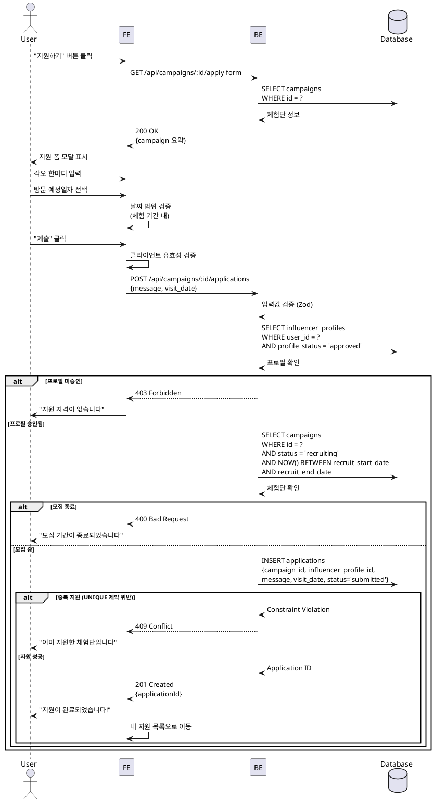

# UC-006: 체험단 지원

## Primary Actor
- 인플루언서 (프로필 승인 완료)

## Precondition
- 사용자가 로그인 상태
- 역할이 'influencer'
- influencer_profiles의 profile_status = 'approved'
- 체험단이 모집 중 (status = 'recruiting')
- 현재 시간이 모집 기간 내
- 해당 체험단에 아직 지원하지 않음

## Trigger
- 체험단 상세 페이지에서 "지원하기" 버튼 클릭

## Main Scenario

1. 사용자가 "지원하기" 버튼 클릭

2. 시스템이 지원 폼 모달/페이지 표시

3. 시스템이 체험단 정보 요약 표시
   - 체험단 제목
   - 모집 인원
   - 모집 마감일

4. 사용자가 지원 정보 입력
   - 각오 한마디 (텍스트 영역, 필수)
   - 방문 예정일자 (날짜 선택, 필수)

5. 시스템이 방문 예정일자 유효성 검증
   - 체험 시작일 ~ 체험 종료일 사이

6. 사용자가 "제출" 버튼 클릭

7. 시스템이 최종 유효성 검증
   - 로그인 상태 재확인
   - 프로필 승인 상태 재확인
   - 모집 기간 내 여부 재확인
   - 중복 지원 여부 재확인

8. 시스템이 applications 테이블에 저장
   - status = 'submitted'

9. 시스템이 성공 메시지 표시
   - "지원이 완료되었습니다!"
   - "선정 결과는 '내 지원 목록'에서 확인하실 수 있습니다"

10. 시스템이 '내 지원 목록' 페이지로 이동

## Edge Cases

### 각오 한마디 미입력
- **발생**: 필수 항목 미입력
- **처리**: "각오 한마디를 입력해주세요" 에러 메시지

### 방문 예정일자 미선택
- **발생**: 날짜 미선택
- **처리**: "방문 예정일자를 선택해주세요" 에러 메시지

### 방문 예정일자 범위 초과
- **발생**: 체험 기간 밖의 날짜 선택
- **처리**: "방문 예정일자는 체험 기간 내로 선택해주세요" 에러 메시지

### 모집 기간 종료
- **발생**: 제출 시점에 모집 기간이 종료됨 (시간차)
- **처리**: "모집 기간이 종료되었습니다" 에러 메시지

### 중복 지원
- **발생**: 다른 탭/창에서 이미 지원함
- **처리**: "이미 지원한 체험단입니다" 에러 메시지, 내 지원 목록으로 이동

### 권한 변경
- **발생**: 지원 중 프로필 상태가 변경됨
- **처리**: "지원 자격이 없습니다. 프로필 상태를 확인해주세요" 에러 메시지

### 체험단 취소
- **발생**: 제출 시점에 체험단이 취소됨
- **처리**: "이 체험단은 취소되었습니다" 에러 메시지

### 네트워크 오류
- **발생**: API 요청 실패
- **처리**: "일시적인 오류가 발생했습니다. 다시 시도해주세요" 에러 메시지

## Business Rules

### BR-001: 지원 자격
- 인플루언서이고 프로필이 승인된 상태만 지원 가능

### BR-002: 중복 지원 방지
- 한 체험단에 한 번만 지원 가능 (DB UNIQUE 제약조건)

### BR-003: 모집 기간 엄수
- 현재 시간이 recruit_start_date ~ recruit_end_date 내일 때만 가능

### BR-004: 방문 예정일자 검증
- experience_start_date ~ experience_end_date 범위 내 날짜만 선택 가능

### BR-005: 각오 한마디 길이
- 최소 10자, 최대 500자 (선택적)

### BR-006: 지원 상태
- 지원 즉시 status = 'submitted'로 저장
- 광고주의 선정 작업 전까지 유지

## Sequence Diagram



## API Endpoints

### GET `/api/campaigns/:id/apply-form`
지원 폼 정보 조회

### Response (200 OK)
```typescript
{
  campaign: {
    id: string;
    title: string;
    recruitCount: number;
    recruitEndDate: string;
    experienceStartDate: string;
    experienceEndDate: string;
  };
}
```

### POST `/api/campaigns/:id/applications`
체험단 지원

### Request Body
```typescript
{
  message: string; // 각오 한마디 (10-500자)
  visitDate: string; // YYYY-MM-DD (체험 기간 내)
}
```

### Response (201 Created)
```typescript
{
  applicationId: string;
  status: 'submitted';
  createdAt: string;
}
```

### Error Responses
- `400 Bad Request`: 유효성 검증 실패, 모집 기간 종료
- `403 Forbidden`: 권한 없음 (프로필 미승인, 광고주 역할)
- `409 Conflict`: 중복 지원
- `500 Internal Server Error`: 서버 오류

