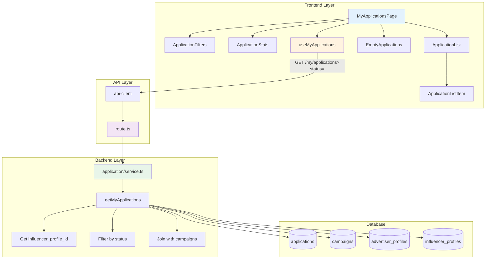

# UC-007: 내 지원 목록 (인플루언서 전용) - 구현 계획

## 개요

### 현재 상태 (Already Implemented)

| 모듈 | 위치 | 상태 |
|------|------|------|
| **getMyApplications** | `src/features/application/backend/service.ts` | ✅ 기본 조회 로직 구현됨 |
| **GET /my/applications** | `src/features/application/backend/route.ts` | ✅ 기본 API 구현됨 |
| **useMyApplications** | `src/features/application/hooks/useApplication.ts` | ✅ 기본 훅 구현됨 |

### 추가 구현 필요 모듈

| 모듈 | 위치 | 설명 |
|------|------|------|
| **/my/applications/page.tsx** | `src/app/(protected)/my/applications/page.tsx` | 내 지원 목록 페이지 |
| **ApplicationListItem** | `src/features/application/components/ApplicationListItem.tsx` | 지원 항목 카드 컴포넌트 |
| **ApplicationFilters** | `src/features/application/components/ApplicationFilters.tsx` | 상태별 필터 탭 |
| **ApplicationStats** | `src/features/application/components/ApplicationStats.tsx` | 통계 표시 |
| **EmptyApplications** | `src/features/application/components/EmptyApplications.tsx` | 빈 상태 UI |

### 공통 모듈 (Shared)

| 모듈 | 위치 | 설명 |
|------|------|------|
| **status-badge.tsx** | `src/components/shared/StatusBadge.tsx` | 상태 배지 컴포넌트 |

---

## Diagram



---

## Implementation Plan

### 1️⃣ Backend Layer - Service Extensions

#### 1.1 Get My Applications with Stats

**구현 내용**:
```typescript
type MyApplicationsResponse = {
  applications: ApplicationListItem[];
  pagination: PaginationInfo;
  stats: {
    total: number;
    submitted: number;
    selected: number;
    rejected: number;
  };
};

export const getMyApplications = async (
  client: SupabaseClient,
  userId: string,
  filters: { status?: ApplicationStatus; page?: number; limit?: number }
): Promise<HandlerResult<MyApplicationsResponse, ApplicationServiceError, unknown>> => {
  try {
    // 1. Get influencer profile
    const { data: profile } = await client
      .from('influencer_profiles')
      .select('id')
      .eq('user_id', userId)
      .maybeSingle();

    if (!profile) {
      return failure(404, applicationErrorCodes.profileNotFound, '인플루언서 프로필을 찾을 수 없습니다');
    }

    // 2. Build query with filters
    let query = client
      .from('applications')
      .select(`
        id,
        message,
        visit_date,
        status,
        created_at,
        campaigns!inner (
          id,
          title,
          location,
          recruit_end_date,
          experience_start_date,
          experience_end_date,
          status,
          advertiser_profiles!inner (
            company_name
          )
        )
      `, { count: 'exact' })
      .eq('influencer_profile_id', profile.id);

    if (filters.status && filters.status !== 'all') {
      query = query.eq('status', filters.status);
    }

    query = query.order('created_at', { ascending: false });

    // 3. Apply pagination
    const page = filters.page || 1;
    const limit = Math.min(filters.limit || 20, 50);
    const from = (page - 1) * limit;
    const to = from + limit - 1;
    
    query = query.range(from, to);

    const { data, error, count } = await query;

    if (error) {
      return failure(500, applicationErrorCodes.applicationFetchError, error.message);
    }

    // 4. Calculate stats
    const { data: statsData } = await client
      .from('applications')
      .select('status')
      .eq('influencer_profile_id', profile.id);

    const stats = {
      total: statsData?.length || 0,
      submitted: statsData?.filter(a => a.status === 'submitted').length || 0,
      selected: statsData?.filter(a => a.status === 'selected').length || 0,
      rejected: statsData?.filter(a => a.status === 'rejected').length || 0,
    };

    // 5. Build response
    const applications = data.map(app => ({
      id: app.id,
      message: app.message,
      visitDate: app.visit_date,
      status: app.status,
      createdAt: app.created_at,
      campaign: {
        id: app.campaigns.id,
        title: app.campaigns.title,
        location: app.campaigns.location,
        recruitEndDate: app.campaigns.recruit_end_date,
        experienceStartDate: app.campaigns.experience_start_date,
        experienceEndDate: app.campaigns.experience_end_date,
        status: app.campaigns.status,
        advertiser: {
          companyName: app.campaigns.advertiser_profiles.company_name,
        },
      },
    }));

    const total = count || 0;
    const totalPages = Math.ceil(total / limit);

    return success({
      applications,
      pagination: {
        page,
        limit,
        total,
        totalPages,
        hasMore: page < totalPages,
      },
      stats,
    });
  } catch (error) {
    return failure(500, applicationErrorCodes.applicationFetchError, error.message);
  }
};
```

**Unit Tests**:
```typescript
describe('getMyApplications', () => {
  it('전체 지원 목록을 반환한다', () => {});
  it('상태별 필터링을 적용한다', () => {});
  it('최신순으로 정렬한다', () => {});
  it('페이지네이션을 적용한다', () => {});
  it('통계를 정확히 계산한다', () => {});
  it('프로필이 없으면 404를 반환한다', () => {});
});
```

---

### 2️⃣ Frontend Layer

#### 2.1 My Applications Page

**구현 내용**:
```typescript
'use client';

export default function MyApplicationsPage() {
  const { user } = useCurrentUser();
  const [filter, setFilter] = useState<ApplicationStatus | 'all'>('all');
  
  const { data, isLoading } = useMyApplications({ status: filter });

  if (!user || user.role !== 'influencer') {
    return <div>인플루언서만 접근 가능합니다</div>;
  }

  return (
    <div className="container mx-auto px-6 py-12">
      <header className="mb-8">
        <h1 className="text-3xl font-bold">내 지원 목록</h1>
        <p className="text-muted-foreground mt-2">
          체험단 지원 현황을 확인하세요
        </p>
      </header>

      {data?.stats && <ApplicationStats stats={data.stats} />}

      <ApplicationFilters currentFilter={filter} onChange={setFilter} />

      {isLoading ? (
        <SkeletonList count={3} />
      ) : !data || data.applications.length === 0 ? (
        <EmptyApplications filter={filter} />
      ) : (
        <div className="space-y-4">
          {data.applications.map(app => (
            <ApplicationListItem key={app.id} application={app} />
          ))}
        </div>
      )}
    </div>
  );
}
```

---

#### 2.2 Application Stats Component

**구현 내용**:
```typescript
type ApplicationStatsProps = {
  stats: {
    total: number;
    submitted: number;
    selected: number;
    rejected: number;
  };
};

export function ApplicationStats({ stats }: ApplicationStatsProps) {
  return (
    <div className="grid grid-cols-4 gap-4 mb-8">
      <Card>
        <CardHeader className="pb-2">
          <CardTitle className="text-sm font-medium text-muted-foreground">전체</CardTitle>
        </CardHeader>
        <CardContent>
          <p className="text-2xl font-bold">{stats.total}</p>
        </CardContent>
      </Card>

      <Card>
        <CardHeader className="pb-2">
          <CardTitle className="text-sm font-medium text-muted-foreground">신청완료</CardTitle>
        </CardHeader>
        <CardContent>
          <p className="text-2xl font-bold text-blue-600">{stats.submitted}</p>
        </CardContent>
      </Card>

      <Card>
        <CardHeader className="pb-2">
          <CardTitle className="text-sm font-medium text-muted-foreground">선정</CardTitle>
        </CardHeader>
        <CardContent>
          <p className="text-2xl font-bold text-green-600">{stats.selected}</p>
        </CardContent>
      </Card>

      <Card>
        <CardHeader className="pb-2">
          <CardTitle className="text-sm font-medium text-muted-foreground">반려</CardTitle>
        </CardHeader>
        <CardContent>
          <p className="text-2xl font-bold text-red-600">{stats.rejected}</p>
        </CardContent>
      </Card>
    </div>
  );
}
```

---

#### 2.3 Application Filters Component

**구현 내용**:
```typescript
type ApplicationFiltersProps = {
  currentFilter: ApplicationStatus | 'all';
  onChange: (filter: ApplicationStatus | 'all') => void;
};

export function ApplicationFilters({ currentFilter, onChange }: ApplicationFiltersProps) {
  const filters: Array<{ value: ApplicationStatus | 'all'; label: string }> = [
    { value: 'all', label: '전체' },
    { value: 'submitted', label: '신청완료' },
    { value: 'selected', label: '선정' },
    { value: 'rejected', label: '반려' },
  ];

  return (
    <div className="flex gap-2 mb-6">
      {filters.map(filter => (
        <Button
          key={filter.value}
          variant={currentFilter === filter.value ? 'default' : 'outline'}
          onClick={() => onChange(filter.value)}
        >
          {filter.label}
        </Button>
      ))}
    </div>
  );
}
```

---

#### 2.4 Application List Item Component

**구현 내용**:
```typescript
type ApplicationListItemProps = {
  application: ApplicationListItem;
};

export function ApplicationListItem({ application }: ApplicationListItemProps) {
  const router = useRouter();

  const statusConfig = {
    submitted: { label: '신청완료', variant: 'secondary' as const },
    selected: { label: '선정', variant: 'default' as const },
    rejected: { label: '반려', variant: 'destructive' as const },
  };

  const status = statusConfig[application.status];

  return (
    <Card
      className="cursor-pointer hover:shadow-md transition-shadow"
      onClick={() => router.push(`/campaigns/${application.campaign.id}`)}
    >
      <CardHeader>
        <div className="flex items-start justify-between">
          <div className="flex-1">
            <CardTitle className="text-lg">{application.campaign.title}</CardTitle>
            <CardDescription className="mt-1">
              {application.campaign.advertiser.companyName} · {application.campaign.location}
            </CardDescription>
          </div>
          <Badge variant={status.variant}>{status.label}</Badge>
        </div>
      </CardHeader>
      <CardContent>
        <div className="space-y-2 text-sm">
          <div className="flex items-center gap-2 text-muted-foreground">
            <Calendar className="h-4 w-4" />
            <span>방문 예정: {format(new Date(application.visitDate), 'yyyy-MM-dd')}</span>
          </div>
          <div className="flex items-center gap-2 text-muted-foreground">
            <Clock className="h-4 w-4" />
            <span>지원일: {format(new Date(application.createdAt), 'yyyy-MM-dd HH:mm')}</span>
          </div>
          <p className="text-muted-foreground line-clamp-2 mt-2">
            {application.message}
          </p>
        </div>
      </CardContent>
    </Card>
  );
}
```

**QA Sheet**:
```yaml
# 동작
- [ ] 카드 클릭 시 체험단 상세 페이지로 이동
- [ ] 상태별 배지 색상 구분 명확

# UI/UX
- [ ] 호버 시 그림자 효과
- [ ] 각오 한마디 2줄 이상 시 말줄임
- [ ] 반응형 레이아웃
```

---

#### 2.5 Empty Applications Component

**구현 내용**:
```typescript
type EmptyApplicationsProps = {
  filter: ApplicationStatus | 'all';
};

export function EmptyApplications({ filter }: EmptyApplicationsProps) {
  const router = useRouter();

  const messages = {
    all: '아직 지원한 체험단이 없습니다',
    submitted: '신청완료 상태의 지원이 없습니다',
    selected: '선정된 체험단이 없습니다',
    rejected: '반려된 지원이 없습니다',
  };

  return (
    <div className="flex flex-col items-center justify-center py-16">
      <p className="text-muted-foreground mb-4">{messages[filter]}</p>
      {filter === 'all' && (
        <Button onClick={() => router.push('/')}>
          체험단 탐색하기
        </Button>
      )}
    </div>
  );
}
```

---

### 3️⃣ Integration

#### 3.1 Protected Route Setup

**라우트 가드**:
```typescript
// src/app/(protected)/my/applications/layout.tsx
export default function MyApplicationsLayout({ children }: { children: React.ReactNode }) {
  const { user, isLoading } = useCurrentUser();
  const router = useRouter();

  useEffect(() => {
    if (!isLoading && (!user || user.role !== 'influencer')) {
      router.replace('/');
    }
  }, [user, isLoading, router]);

  if (isLoading) return <div>로딩 중...</div>;
  if (!user || user.role !== 'influencer') return null;

  return <>{children}</>;
}
```

---

## 구현 순서

### Phase 1: Backend Extensions
1. ✅ getMyApplications에 stats 계산 추가
2. ✅ Schema 추가

### Phase 2: Frontend Components
3. ✅ ApplicationStats 구현
4. ✅ ApplicationFilters 구현
5. ✅ ApplicationListItem 구현
6. ✅ EmptyApplications 구현
7. ✅ MyApplicationsPage 구현

### Phase 3: Testing
8. ✅ E2E 시나리오 테스트

---

## 테스트 전략

### Unit Tests
- ✅ getMyApplications (필터링, 통계)

### Integration Tests
- ✅ GET /my/applications

### E2E Tests
- ✅ 필터 변경 → 목록 갱신
- ✅ 빈 목록 → EmptyState 표시
- ✅ 카드 클릭 → 상세 페이지 이동

---

## Dependencies

### 기존 shadcn-ui 컴포넌트 활용
- ✅ Card, Badge, Button

### 기존 라이브러리 활용
- ✅ date-fns, lucide-react

---

## 향후 개선사항

1. 지원 취소 기능
2. 정렬 옵션 (최신순, 마감임박순)
3. 검색 기능

