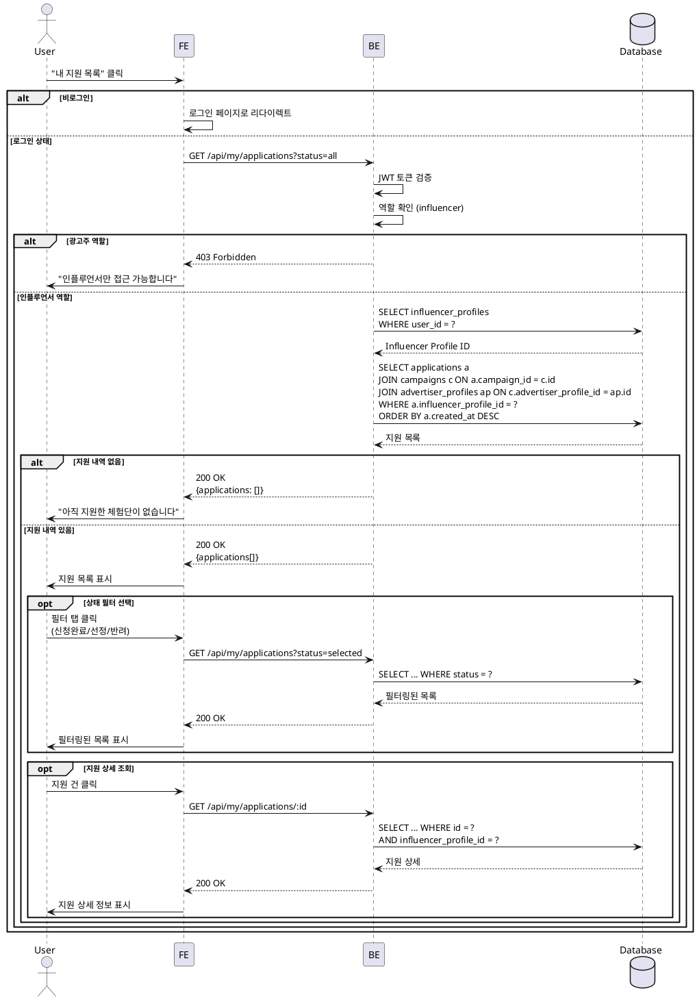

# UC-007: 내 지원 목록 (인플루언서 전용)

## Primary Actor
- 인플루언서

## Precondition
- 사용자가 로그인 상태
- 역할이 'influencer'

## Trigger
- 네비게이션 메뉴에서 "내 지원 목록" 클릭
- 체험단 지원 완료 후 자동 리다이렉트

## Main Scenario

1. 사용자가 "내 지원 목록" 페이지 접속

2. 시스템이 사용자의 지원 내역 조회
   - influencer_profile_id = 현재 사용자
   - 최신순 정렬 (created_at DESC)

3. 시스템이 상태별 필터 탭 표시
   - 전체
   - 신청완료 (submitted)
   - 선정 (selected)
   - 반려 (rejected)

4. 시스템이 지원 목록 렌더링
   - 체험단 정보 (제목, 매장 위치)
   - 지원 정보 (각오 한마디, 방문 예정일)
   - 지원 일시
   - 지원 상태 배지

5. 사용자가 상태 필터 선택 (선택사항)

6. 시스템이 필터링된 목록 재조회 및 표시

7. 사용자가 특정 지원 건 클릭

8. 시스템이 지원 상세 정보 표시
   - 전체 지원 정보
   - 체험단 상세 정보
   - 선정 시 추가 안내사항

## Edge Cases

### 지원 내역 없음
- **발생**: 한 번도 지원하지 않음
- **처리**: "아직 지원한 체험단이 없습니다" 안내 메시지, 홈으로 이동 버튼 제공

### 필터 결과 없음
- **발생**: 선택한 상태의 지원 건이 없음
- **처리**: "해당 상태의 지원 건이 없습니다" 메시지 표시

### 광고주 접근 시도
- **발생**: 광고주 역할 사용자가 접근
- **처리**: 403 페이지, "인플루언서만 접근 가능합니다"

### 비로그인 접근
- **발생**: 로그인하지 않은 상태에서 접근
- **처리**: 로그인 페이지로 리다이렉트

### 체험단 삭제됨
- **발생**: 지원한 체험단이 삭제됨
- **처리**: 지원 내역은 유지, 체험단 정보 "삭제된 체험단" 표시

### 네트워크 오류
- **발생**: API 요청 실패
- **처리**: "데이터를 불러오는 중 오류가 발생했습니다" 에러 메시지, 재시도 버튼

## Business Rules

### BR-001: 본인 지원 내역만 조회
- 자신의 influencer_profile_id로 지원한 내역만 조회 가능

### BR-002: 상태별 필터
- submitted (신청완료): 광고주의 선정 대기 중
- selected (선정): 체험단 참여 확정
- rejected (반려): 선정되지 않음

### BR-003: 정렬
- 기본 정렬: 최신 지원순 (created_at DESC)

### BR-004: 지원 취소
- 지원 취소 기능 없음 (선택적 구현 가능)

### BR-005: 상태 업데이트
- 광고주의 선정 작업에 의해서만 상태 변경됨

## Sequence Diagram



## API Endpoints

### GET `/api/my/applications`
내 지원 목록 조회

### Query Parameters
```typescript
{
  status?: 'all' | 'submitted' | 'selected' | 'rejected'; // 기본값: all
  page?: number; // 기본값: 1
  limit?: number; // 기본값: 20
}
```

### Response (200 OK)
```typescript
{
  applications: Array<{
    id: string;
    message: string;
    visitDate: string;
    status: 'submitted' | 'selected' | 'rejected';
    createdAt: string;
    campaign: {
      id: string;
      title: string;
      location: string;
      recruitEndDate: string;
      experienceStartDate: string;
      experienceEndDate: string;
      status: 'recruiting' | 'recruit_ended' | 'selection_completed' | 'cancelled';
      advertiser: {
        companyName: string;
      };
    };
  }>;
  pagination: {
    page: number;
    limit: number;
    total: number;
    hasMore: boolean;
  };
  stats: {
    total: number;
    submitted: number;
    selected: number;
    rejected: number;
  };
}
```

### GET `/api/my/applications/:id`
지원 상세 조회

### Response (200 OK)
```typescript
{
  application: {
    id: string;
    message: string;
    visitDate: string;
    status: 'submitted' | 'selected' | 'rejected';
    createdAt: string;
    updatedAt: string;
    campaign: {
      // 체험단 전체 정보
    };
  };
}
```

### Error Responses
- `403 Forbidden`: 권한 없음 (광고주, 타인의 지원 내역)
- `404 Not Found`: 지원 내역 없음
- `500 Internal Server Error`: 서버 오류

