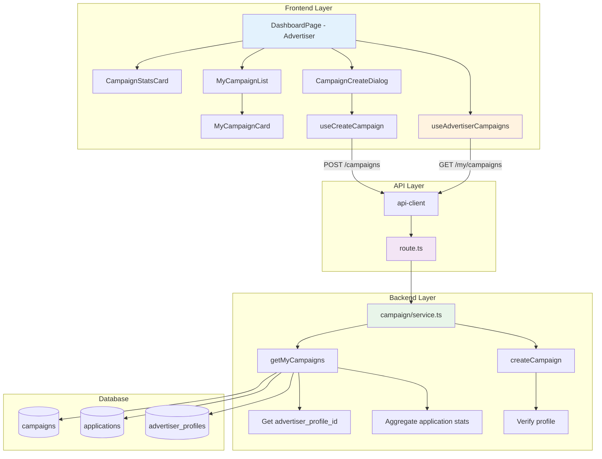

# UC-008: 광고주 체험단 관리 - 구현 계획

## 개요

### 현재 상태 (Already Implemented)

| 모듈 | 위치 | 상태 |
|------|------|------|
| **createCampaign** | `src/features/campaign/backend/service.ts` | ✅ 생성 로직 구현됨 |
| **getMyCampaigns** | `src/features/campaign/backend/service.ts` | ✅ 조회 로직 구현됨 |
| **POST /campaigns** | `src/features/campaign/backend/route.ts` | ✅ 생성 API 구현됨 |
| **GET /my/campaigns** | `src/features/campaign/backend/route.ts` | ✅ 조회 API 구현됨 |
| **useAdvertiserCampaigns** | `src/features/campaign/hooks/useCampaign.ts` | ✅ 기본 훅 구현됨 |
| **MyCampaignList** | `src/features/campaign/components/MyCampaignList.tsx` | ✅ 기본 목록 구현됨 |

### 추가 구현 필요 모듈

| 모듈 | 위치 | 설명 |
|------|------|------|
| **getCampaignWithStats** | `src/features/campaign/backend/service.ts` | 지원자 통계 포함 조회 |
| **CampaignCreateDialog** | `src/features/campaign/components/CampaignCreateDialog.tsx` | 체험단 등록 다이얼로그 |
| **MyCampaignCard** | `src/features/campaign/components/MyCampaignCard.tsx` | 내 체험단 카드 |
| **CampaignStatsCard** | `src/features/campaign/components/CampaignStatsCard.tsx` | 통계 카드 |

### 공통 모듈 (Shared)

| 모듈 | 위치 | 설명 |
|------|------|------|
| **role-guard.ts** | `src/lib/guards/role.ts` | 역할 기반 권한 체크 |

---

## Diagram



---

## Implementation Plan

### 1️⃣ Backend Layer - Extensions

#### 1.1 Get My Campaigns with Stats

**구현 내용**:
```typescript
type MyCampaignWithStats = {
  campaign: CampaignResponse;
  stats: {
    totalApplications: number;
    submittedCount: number;
    selectedCount: number;
    rejectedCount: number;
  };
};

export const getMyCampaigns = async (
  client: SupabaseClient,
  userId: string
): Promise<HandlerResult<MyCampaignWithStats[], CampaignServiceError, unknown>> => {
  try {
    // 1. Get advertiser profile
    const { data: profile } = await client
      .from('advertiser_profiles')
      .select('id, verification_status')
      .eq('user_id', userId)
      .maybeSingle();

    if (!profile) {
      return failure(404, campaignErrorCodes.profileNotFound, '광고주 프로필을 찾을 수 없습니다');
    }

    // 2. Get campaigns
    const { data: campaigns, error } = await client
      .from('campaigns')
      .select('*')
      .eq('advertiser_profile_id', profile.id)
      .order('created_at', { ascending: false });

    if (error) {
      return failure(500, campaignErrorCodes.campaignFetchError, error.message);
    }

    if (!campaigns || campaigns.length === 0) {
      return success([]);
    }

    // 3. Get application stats for each campaign
    const campaignIds = campaigns.map(c => c.id);
    const { data: applications } = await client
      .from('applications')
      .select('campaign_id, status')
      .in('campaign_id', campaignIds);

    // 4. Aggregate stats
    const statsMap: Record<string, any> = {};
    
    campaigns.forEach(campaign => {
      const campaignApps = applications?.filter(a => a.campaign_id === campaign.id) || [];
      
      statsMap[campaign.id] = {
        totalApplications: campaignApps.length,
        submittedCount: campaignApps.filter(a => a.status === 'submitted').length,
        selectedCount: campaignApps.filter(a => a.status === 'selected').length,
        rejectedCount: campaignApps.filter(a => a.status === 'rejected').length,
      };
    });

    // 5. Build response
    const result = campaigns.map(campaign => ({
      campaign: mapCampaignRowToResponse(campaign),
      stats: statsMap[campaign.id],
    }));

    return success(result);
  } catch (error) {
    return failure(500, campaignErrorCodes.campaignFetchError, error.message);
  }
};
```

**Unit Tests**:
```typescript
describe('getMyCampaigns', () => {
  it('내 체험단 목록과 통계를 반환한다', () => {});
  it('프로필이 없으면 404를 반환한다', () => {});
  it('체험단이 없으면 빈 배열을 반환한다', () => {});
  it('각 체험단의 지원자 통계를 정확히 집계한다', () => {});
});
```

---

### 2️⃣ Frontend Layer

#### 2.1 Dashboard Page Update (Advertiser)

**구현 내용**:
```typescript
// src/app/(protected)/dashboard/page.tsx 수정
export default function DashboardPage() {
  const { user } = useCurrentUser();

  if (user?.role === 'advertiser') {
    return <AdvertiserDashboard />;
  } else if (user?.role === 'influencer') {
    return <InfluencerDashboard />;
  }

  return <div>권한이 없습니다</div>;
}

function AdvertiserDashboard() {
  const router = useRouter();
  const [isCreateDialogOpen, setIsCreateDialogOpen] = useState(false);
  const { data: campaignsWithStats, isLoading } = useAdvertiserCampaigns();

  const overallStats = useMemo(() => {
    if (!campaignsWithStats) return null;
    
    return {
      totalCampaigns: campaignsWithStats.length,
      activeCampaigns: campaignsWithStats.filter(c => c.campaign.status === 'recruiting').length,
      totalApplications: campaignsWithStats.reduce((sum, c) => sum + c.stats.totalApplications, 0),
      selectedCount: campaignsWithStats.reduce((sum, c) => sum + c.stats.selectedCount, 0),
    };
  }, [campaignsWithStats]);

  return (
    <div className="container mx-auto px-6 py-12">
      <header className="mb-8 flex items-center justify-between">
        <div>
          <h1 className="text-3xl font-bold">체험단 관리</h1>
          <p className="text-muted-foreground mt-2">등록한 체험단을 관리하세요</p>
        </div>
        <Button onClick={() => setIsCreateDialogOpen(true)}>
          + 체험단 등록
        </Button>
      </header>

      {overallStats && (
        <div className="grid grid-cols-4 gap-4 mb-8">
          <CampaignStatsCard label="전체 체험단" value={overallStats.totalCampaigns} />
          <CampaignStatsCard label="모집 중" value={overallStats.activeCampaigns} />
          <CampaignStatsCard label="전체 지원자" value={overallStats.totalApplications} />
          <CampaignStatsCard label="선정 완료" value={overallStats.selectedCount} />
        </div>
      )}

      {isLoading ? (
        <SkeletonList count={3} />
      ) : !campaignsWithStats || campaignsWithStats.length === 0 ? (
        <EmptyState
          message="등록된 체험단이 없습니다"
          action={{ label: '첫 체험단 등록하기', onClick: () => setIsCreateDialogOpen(true) }}
        />
      ) : (
        <div className="space-y-4">
          {campaignsWithStats.map(({ campaign, stats }) => (
            <MyCampaignCard
              key={campaign.id}
              campaign={campaign}
              stats={stats}
              onClick={() => router.push(`/dashboard/campaigns/${campaign.id}`)}
            />
          ))}
        </div>
      )}

      <CampaignCreateDialog
        isOpen={isCreateDialogOpen}
        onClose={() => setIsCreateDialogOpen(false)}
      />
    </div>
  );
}
```

---

#### 2.2 Campaign Stats Card

**구현 내용**:
```typescript
type CampaignStatsCardProps = {
  label: string;
  value: number;
  trend?: {
    value: number;
    isPositive: boolean;
  };
};

export function CampaignStatsCard({ label, value, trend }: CampaignStatsCardProps) {
  return (
    <Card>
      <CardHeader className="pb-2">
        <CardTitle className="text-sm font-medium text-muted-foreground">
          {label}
        </CardTitle>
      </CardHeader>
      <CardContent>
        <div className="flex items-end justify-between">
          <p className="text-2xl font-bold">{value}</p>
          {trend && (
            <div className={cn(
              "flex items-center text-sm",
              trend.isPositive ? "text-green-600" : "text-red-600"
            )}>
              {trend.isPositive ? <TrendingUp className="h-4 w-4" /> : <TrendingDown className="h-4 w-4" />}
              <span className="ml-1">{trend.value}%</span>
            </div>
          )}
        </div>
      </CardContent>
    </Card>
  );
}
```

---

#### 2.3 My Campaign Card

**구현 내용**:
```typescript
type MyCampaignCardProps = {
  campaign: CampaignResponse;
  stats: {
    totalApplications: number;
    submittedCount: number;
    selectedCount: number;
    rejectedCount: number;
  };
  onClick: () => void;
};

export function MyCampaignCard({ campaign, stats, onClick }: MyCampaignCardProps) {
  const statusConfig = {
    recruiting: { label: '모집 중', variant: 'default' as const },
    recruit_ended: { label: '모집 종료', variant: 'secondary' as const },
    selection_completed: { label: '선정 완료', variant: 'outline' as const },
    cancelled: { label: '취소', variant: 'destructive' as const },
  };

  const status = statusConfig[campaign.status];

  return (
    <Card className="cursor-pointer hover:shadow-md transition-shadow" onClick={onClick}>
      <CardHeader>
        <div className="flex items-start justify-between">
          <div className="flex-1">
            <CardTitle className="text-lg">{campaign.title}</CardTitle>
            <CardDescription className="mt-1">
              {campaign.location}
            </CardDescription>
          </div>
          <Badge variant={status.variant}>{status.label}</Badge>
        </div>
      </CardHeader>
      <CardContent>
        <div className="grid grid-cols-4 gap-4 text-center">
          <div>
            <p className="text-sm text-muted-foreground">모집 인원</p>
            <p className="text-lg font-semibold">{campaign.recruitCount}명</p>
          </div>
          <div>
            <p className="text-sm text-muted-foreground">전체 지원</p>
            <p className="text-lg font-semibold">{stats.totalApplications}명</p>
          </div>
          <div>
            <p className="text-sm text-muted-foreground">선정</p>
            <p className="text-lg font-semibold text-green-600">{stats.selectedCount}명</p>
          </div>
          <div>
            <p className="text-sm text-muted-foreground">마감일</p>
            <p className="text-sm">{format(new Date(campaign.recruitEndDate), 'MM/dd')}</p>
          </div>
        </div>
      </CardContent>
    </Card>
  );
}
```

**QA Sheet**:
```yaml
# 동작
- [ ] 카드 클릭 시 상세 페이지로 이동
- [ ] 상태별 배지 색상 구분
- [ ] 통계 정확히 표시

# UI/UX
- [ ] 호버 시 그림자 효과
- [ ] 반응형 그리드 (모바일: 2x2)
```

---

#### 2.4 Campaign Create Dialog

**구현 내용**:
```typescript
type CampaignCreateDialogProps = {
  isOpen: boolean;
  onClose: () => void;
};

export function CampaignCreateDialog({ isOpen, onClose }: CampaignCreateDialogProps) {
  const router = useRouter();
  const { mutate: createCampaign, isLoading } = useCreateCampaign();

  const form = useForm<CampaignCreateRequest>({
    resolver: zodResolver(CampaignCreateSchema),
    defaultValues: {
      title: '',
      description: '',
      location: '',
      benefits: '',
      mission: '',
      recruitCount: 1,
      recruitStartDate: new Date().toISOString(),
      recruitEndDate: '',
      experienceStartDate: '',
      experienceEndDate: '',
    },
  });

  const onSubmit = (data: CampaignCreateRequest) => {
    createCampaign(data, {
      onSuccess: (response) => {
        toast.success('체험단이 등록되었습니다');
        onClose();
        router.push(`/dashboard/campaigns/${response.id}`);
      },
      onError: (error) => {
        toast.error(error.response?.data?.error?.message || '등록에 실패했습니다');
      },
    });
  };

  return (
    <Dialog open={isOpen} onOpenChange={onClose}>
      <DialogContent className="max-w-2xl max-h-[90vh] overflow-y-auto">
        <DialogHeader>
          <DialogTitle>체험단 등록</DialogTitle>
          <DialogDescription>
            새로운 체험단을 등록하세요
          </DialogDescription>
        </DialogHeader>

        <Form {...form}>
          <form onSubmit={form.handleSubmit(onSubmit)} className="space-y-6">
            {/* 제목 */}
            <FormField name="title" control={form.control} render={...} />

            {/* 설명 */}
            <FormField name="description" control={form.control} render={...} />

            {/* 위치 */}
            <FormField name="location" control={form.control} render={...} />

            {/* 혜택 */}
            <FormField name="benefits" control={form.control} render={...} />

            {/* 미션 */}
            <FormField name="mission" control={form.control} render={...} />

            {/* 모집 인원 */}
            <FormField name="recruitCount" control={form.control} render={...} />

            {/* 모집 기간 */}
            <div className="grid grid-cols-2 gap-4">
              <FormField name="recruitStartDate" control={form.control} render={...} />
              <FormField name="recruitEndDate" control={form.control} render={...} />
            </div>

            {/* 체험 기간 */}
            <div className="grid grid-cols-2 gap-4">
              <FormField name="experienceStartDate" control={form.control} render={...} />
              <FormField name="experienceEndDate" control={form.control} render={...} />
            </div>

            <DialogFooter>
              <Button type="button" variant="outline" onClick={onClose}>
                취소
              </Button>
              <Button type="submit" disabled={isLoading}>
                {isLoading ? '등록 중...' : '등록하기'}
              </Button>
            </DialogFooter>
          </form>
        </Form>
      </DialogContent>
    </Dialog>
  );
}
```

**QA Sheet**:
```yaml
# 동작
- [ ] 모든 필드 유효성 검증
- [ ] 모집 종료일 >= 시작일
- [ ] 체험 종료일 >= 시작일
- [ ] 제출 성공 → 상세 페이지로 이동

# UI/UX
- [ ] 스크롤 가능한 다이얼로그
- [ ] 폼 에러 메시지 명확
- [ ] 로딩 상태 표시
```

---

## 구현 순서

### Phase 1: Backend Extensions
1. ✅ getMyCampaigns에 stats 집계 추가

### Phase 2: Frontend Components
2. ✅ CampaignStatsCard 구현
3. ✅ MyCampaignCard 구현
4. ✅ CampaignCreateDialog 구현
5. ✅ AdvertiserDashboard 개선

### Phase 3: Testing
6. ✅ E2E 시나리오 테스트

---

## 테스트 전략

### Unit Tests
- ✅ getMyCampaigns (stats 집계)

### Integration Tests
- ✅ GET /my/campaigns
- ✅ POST /campaigns

### E2E Tests
- ✅ 체험단 등록 → 목록에 표시
- ✅ 빈 목록 → EmptyState
- ✅ 카드 클릭 → 상세 페이지

---

## Dependencies

### 기존 shadcn-ui 컴포넌트 활용
- ✅ Dialog, Form, Card, Badge

### 기존 라이브러리 활용
- ✅ react-hook-form, zod, date-fns

---

## 향후 개선사항

1. 체험단 수정 기능
2. 체험단 복사 기능
3. 통계 차트 (지원자 추이)

