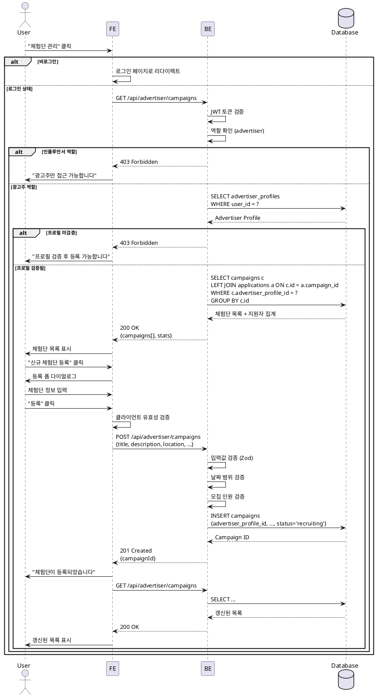

# UC-008: 광고주 체험단 관리

## Primary Actor
- 광고주 (프로필 검증 완료)

## Precondition
- 사용자가 로그인 상태
- 역할이 'advertiser'
- advertiser_profiles의 verification_status = 'verified'

## Trigger
- 네비게이션 메뉴에서 "체험단 관리" 클릭

## Main Scenario

1. 사용자가 "체험단 관리" 페이지 접속

2. 시스템이 광고주의 체험단 목록 조회
   - advertiser_profile_id = 현재 사용자
   - 최신순 정렬

3. 시스템이 각 체험단별 지원 현황 집계
   - 총 지원자 수
   - 상태별 지원자 수

4. 시스템이 체험단 목록 렌더링
   - 체험단 제목, 위치
   - 모집 인원 / 지원자 수
   - 모집 기간
   - 상태 배지
   - 관리 버튼

5. 사용자가 "신규 체험단 등록" 버튼 클릭

6. 시스템이 등록 폼 다이얼로그 표시

7. 사용자가 체험단 정보 입력
   - 제목, 설명
   - 매장 위치
   - 혜택
   - 미션
   - 모집 인원
   - 모집 기간
   - 체험 기간

8. 사용자가 "등록" 버튼 클릭

9. 시스템이 유효성 검증

10. 시스템이 campaigns 테이블에 저장
    - status = 'recruiting'

11. 시스템이 성공 메시지 표시

12. 시스템이 목록 갱신

## Edge Cases

### 프로필 미검증
- **발생**: verification_status != 'verified'
- **처리**: "프로필 검증 후 체험단 등록 가능합니다" 안내, 프로필 페이지 링크

### 체험단 없음
- **발생**: 등록한 체험단이 없음
- **처리**: "등록된 체험단이 없습니다. 첫 체험단을 등록해보세요" 안내

### 필수 항목 미입력
- **발생**: 제목, 위치 등 필수 항목 누락
- **처리**: "모든 필수 항목을 입력해주세요" 에러 메시지

### 잘못된 날짜 범위
- **발생**: 모집 종료일 < 모집 시작일
- **처리**: "모집 종료일은 시작일 이후여야 합니다" 에러 메시지

### 잘못된 모집 인원
- **발생**: 모집 인원 0 이하
- **처리**: "모집 인원은 1명 이상이어야 합니다" 에러 메시지

### 인플루언서 접근
- **발생**: 인플루언서 역할 사용자가 접근
- **처리**: 403 페이지, "광고주만 접근 가능합니다"

### 비로그인 접근
- **발생**: 로그인하지 않은 상태에서 접근
- **처리**: 로그인 페이지로 리다이렉트

## Business Rules

### BR-001: 등록 권한
- verification_status = 'verified'인 광고주만 체험단 등록 가능

### BR-002: 초기 상태
- 새로 등록된 체험단은 status = 'recruiting'

### BR-003: 모집 인원
- 최소 1명 이상

### BR-004: 날짜 검증
- 모집 종료일 >= 모집 시작일
- 체험 종료일 >= 체험 시작일

### BR-005: 본인 체험단만 조회
- 자신의 advertiser_profile_id로 등록한 체험단만 조회/관리 가능

### BR-006: 체험단 수정
- 모집 중 상태에서만 수정 가능
- 모집 종료 이후 수정 불가

## Sequence Diagram



## API Endpoints

### GET `/api/advertiser/campaigns`
내 체험단 목록 조회

### Response (200 OK)
```typescript
{
  campaigns: Array<{
    id: string;
    title: string;
    location: string;
    recruitCount: number;
    recruitStartDate: string;
    recruitEndDate: string;
    experienceStartDate: string;
    experienceEndDate: string;
    status: 'recruiting' | 'recruit_ended' | 'selection_completed' | 'cancelled';
    createdAt: string;
    stats: {
      totalApplications: number;
      submittedCount: number;
      selectedCount: number;
      rejectedCount: number;
    };
  }>;
}
```

### POST `/api/advertiser/campaigns`
체험단 등록

### Request Body
```typescript
{
  title: string;
  description: string;
  location: string;
  benefits: string;
  mission: string;
  recruitCount: number; // >= 1
  recruitStartDate: string; // ISO 8601
  recruitEndDate: string; // >= recruitStartDate
  experienceStartDate: string; // YYYY-MM-DD
  experienceEndDate: string; // >= experienceStartDate
}
```

### Response (201 Created)
```typescript
{
  campaignId: string;
  status: 'recruiting';
  createdAt: string;
}
```

### Error Responses
- `400 Bad Request`: 유효성 검증 실패
- `403 Forbidden`: 권한 없음 (미검증, 인플루언서 역할)
- `500 Internal Server Error`: 서버 오류

