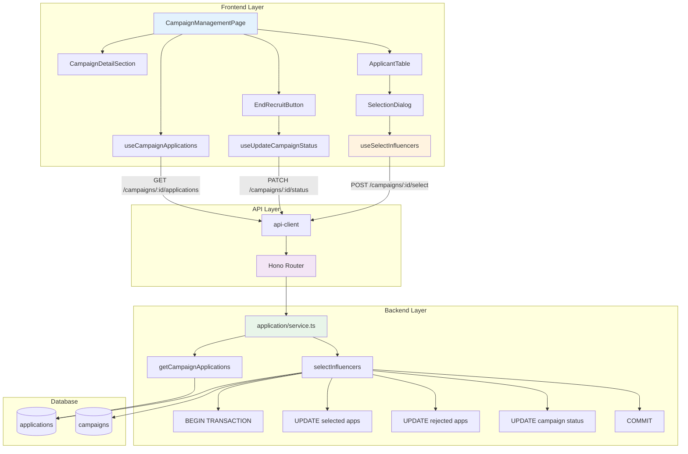

# UC-009: 광고주 체험단 상세 & 모집 관리 - 구현 계획

## 개요

### 현재 상태 (Already Implemented)

| 모듈 | 위치 | 상태 |
|------|------|------|
| **getCampaignById** | `src/features/campaign/backend/service.ts` | ✅ 기본 조회 구현됨 |
| **updateCampaignStatus** | `src/features/campaign/backend/service.ts` | ✅ 상태 업데이트 구현됨 |
| **getCampaignApplications** | `src/features/application/backend/service.ts` | ✅ 지원자 목록 조회 구현됨 |
| **PATCH /campaigns/:id/status** | `src/features/campaign/backend/route.ts` | ✅ 상태 업데이트 API 구현됨 |

### 추가 구현 필요 모듈

| 모듈 | 위치 | 설명 |
|------|------|------|
| **selectInfluencers** | `src/features/application/backend/service.ts` | 인플루언서 선정 로직 (트랜잭션) |
| **POST /campaigns/:id/select** | `src/features/application/backend/route.ts` | 선정 API |
| **/dashboard/campaigns/[id]/page.tsx** | `src/app/(protected)/dashboard/campaigns/[id]/page.tsx` | 광고주 체험단 상세 페이지 |
| **ApplicantTable** | `src/features/application/components/ApplicantTable.tsx` | 지원자 테이블 |
| **SelectionDialog** | `src/features/application/components/SelectionDialog.tsx` | 선정 다이얼로그 |
| **EndRecruitButton** | `src/features/campaign/components/EndRecruitButton.tsx` | 모집 종료 버튼 |

### 공통 모듈 (Shared)

| 모듈 | 위치 | 설명 |
|------|------|------|
| **transaction.ts** | `src/backend/utils/transaction.ts` | 트랜잭션 헬퍼 |

---

## Diagram



---

## Implementation Plan

### 1️⃣ Backend Layer - Selection Logic

#### 1.1 Select Influencers (Transaction)

**구현 내용**:
```typescript
type SelectInfluencersRequest = {
  selectedApplicationIds: string[];
};

type SelectInfluencersResponse = {
  campaignId: string;
  selectedCount: number;
  rejectedCount: number;
  status: 'selection_completed';
};

export const selectInfluencers = async (
  client: SupabaseClient,
  userId: string,
  campaignId: string,
  data: SelectInfluencersRequest
): Promise<HandlerResult<SelectInfluencersResponse, ApplicationServiceError, unknown>> => {
  try {
    // 1. Verify ownership
    const { data: campaign } = await client
      .from('campaigns')
      .select(`
        id,
        status,
        recruit_count,
        advertiser_profiles!inner (
          user_id
        )
      `)
      .eq('id', campaignId)
      .single();

    if (!campaign) {
      return failure(404, applicationErrorCodes.campaignNotFound, '체험단을 찾을 수 없습니다');
    }

    if (campaign.advertiser_profiles.user_id !== userId) {
      return failure(403, applicationErrorCodes.notOwner, '권한이 없습니다');
    }

    if (campaign.status !== 'recruit_ended') {
      return failure(400, applicationErrorCodes.invalidStatus, '모집 종료 상태에서만 선정 가능합니다');
    }

    // 2. Validate selection count
    if (data.selectedApplicationIds.length > campaign.recruit_count) {
      return failure(
        400,
        applicationErrorCodes.invalidSelectionCount,
        `모집 인원(${campaign.recruit_count}명)보다 많이 선택할 수 없습니다`
      );
    }

    // 3. Transaction: Update applications and campaign
    // Note: Supabase doesn't support explicit transactions, so we do sequential updates
    // with error handling and rollback logic

    // 3-1. Update selected applications
    const { error: selectError } = await client
      .from('applications')
      .update({ status: 'selected' })
      .in('id', data.selectedApplicationIds)
      .eq('campaign_id', campaignId);

    if (selectError) {
      return failure(500, applicationErrorCodes.selectionFailed, selectError.message);
    }

    // 3-2. Update rejected applications
    const { error: rejectError } = await client
      .from('applications')
      .update({ status: 'rejected' })
      .eq('campaign_id', campaignId)
      .not('id', 'in', `(${data.selectedApplicationIds.join(',')})`);

    if (rejectError) {
      // Rollback selected
      await client
        .from('applications')
        .update({ status: 'submitted' })
        .in('id', data.selectedApplicationIds);

      return failure(500, applicationErrorCodes.selectionFailed, rejectError.message);
    }

    // 3-3. Update campaign status
    const { error: campaignError } = await client
      .from('campaigns')
      .update({ status: 'selection_completed' })
      .eq('id', campaignId);

    if (campaignError) {
      // Rollback all
      await client
        .from('applications')
        .update({ status: 'submitted' })
        .eq('campaign_id', campaignId);

      return failure(500, applicationErrorCodes.selectionFailed, campaignError.message);
    }

    // 4. Get final counts
    const { data: allApps } = await client
      .from('applications')
      .select('status')
      .eq('campaign_id', campaignId);

    const selectedCount = allApps?.filter(a => a.status === 'selected').length || 0;
    const rejectedCount = allApps?.filter(a => a.status === 'rejected').length || 0;

    return success({
      campaignId,
      selectedCount,
      rejectedCount,
      status: 'selection_completed',
    }, 200);
  } catch (error) {
    return failure(500, applicationErrorCodes.selectionFailed, error.message);
  }
};
```

**Unit Tests**:
```typescript
describe('selectInfluencers', () => {
  it('선정된 지원자 상태를 selected로 업데이트한다', () => {});
  it('나머지 지원자 상태를 rejected로 업데이트한다', () => {});
  it('체험단 상태를 selection_completed로 업데이트한다', () => {});
  it('모집 인원보다 많이 선택 시 400을 반환한다', () => {});
  it('타인의 체험단 선정 시도 시 403을 반환한다', () => {});
  it('recruit_ended 상태가 아니면 400을 반환한다', () => {});
  it('업데이트 실패 시 롤백한다', () => {});
});
```

---

#### 1.2 Schema Extensions

**추가 스키마**:
```typescript
// application/backend/schema.ts
export const SelectInfluencersRequestSchema = z.object({
  selectedApplicationIds: z.array(z.string().uuid()).min(1, '최소 1명 이상 선택해주세요'),
});

export type SelectInfluencersRequest = z.infer<typeof SelectInfluencersRequestSchema>;

export const SelectInfluencersResponseSchema = z.object({
  campaignId: z.string(),
  selectedCount: z.number(),
  rejectedCount: z.number(),
  status: z.literal('selection_completed'),
});

export type SelectInfluencersResponse = z.infer<typeof SelectInfluencersResponseSchema>;
```

---

#### 1.3 Route Extensions

**추가 라우트**:
```typescript
// application/backend/route.ts
app.post('/campaigns/:id/select', async (c) => {
  const supabase = getSupabase(c);
  const logger = getLogger(c);
  const campaignId = c.req.param('id');

  const { data: authData } = await supabase.auth.getUser();
  if (!authData.user) {
    return respond(c, failure(401, applicationErrorCodes.unauthorized, '인증이 필요합니다'));
  }

  const body = await c.req.json();
  const parsed = SelectInfluencersRequestSchema.safeParse(body);

  if (!parsed.success) {
    return respond(
      c,
      failure(400, applicationErrorCodes.invalidRequest, '입력값이 올바르지 않습니다', parsed.error)
    );
  }

  const result = await selectInfluencers(supabase, authData.user.id, campaignId, parsed.data);

  if (!result.ok) {
    logger.error('Influencer selection failed', result.error);
  }

  return respond(c, result);
});
```

---

### 2️⃣ Frontend Layer

#### 2.1 Campaign Management Detail Page

**구현 내용**:
```typescript
export default async function CampaignManagementPage({ params }: { params: Promise<{ id: string }> }) {
  const { id } = await params;

  return <CampaignManagementContent campaignId={id} />;
}

function CampaignManagementContent({ campaignId }: { campaignId: string }) {
  const { user } = useCurrentUser();
  const { data: campaign, isLoading: campaignLoading } = useCampaignById(campaignId);
  const { data: applications, isLoading: applicationsLoading } = useCampaignApplications(campaignId);
  const [isSelectionDialogOpen, setIsSelectionDialogOpen] = useState(false);

  if (campaignLoading) return <div>로딩 중...</div>;
  if (!campaign) return <div>체험단을 찾을 수 없습니다</div>;

  return (
    <div className="container mx-auto px-6 py-12">
      <header className="mb-8">
        <h1 className="text-3xl font-bold">{campaign.title}</h1>
        <div className="flex items-center gap-4 mt-2">
          <Badge>{campaign.status}</Badge>
          <span className="text-muted-foreground">{campaign.location}</span>
        </div>
      </header>

      <div className="grid grid-cols-1 lg:grid-cols-3 gap-8">
        {/* Main Content */}
        <div className="lg:col-span-2 space-y-8">
          <CampaignDetailSection campaign={campaign} />

          <Card>
            <CardHeader>
              <CardTitle>지원자 목록</CardTitle>
              <CardDescription>
                총 {applications?.length || 0}명이 지원했습니다
              </CardDescription>
            </CardHeader>
            <CardContent>
              {applicationsLoading ? (
                <div>로딩 중...</div>
              ) : !applications || applications.length === 0 ? (
                <p className="text-muted-foreground text-center py-8">
                  아직 지원자가 없습니다
                </p>
              ) : (
                <ApplicantTable applications={applications} />
              )}
            </CardContent>
          </Card>
        </div>

        {/* Sidebar */}
        <aside className="space-y-6">
          <Card>
            <CardHeader>
              <CardTitle>관리</CardTitle>
            </CardHeader>
            <CardContent className="space-y-4">
              {campaign.status === 'recruiting' && (
                <EndRecruitButton campaignId={campaignId} />
              )}

              {campaign.status === 'recruit_ended' && applications && applications.length > 0 && (
                <Button
                  onClick={() => setIsSelectionDialogOpen(true)}
                  className="w-full"
                >
                  인플루언서 선정하기
                </Button>
              )}

              {campaign.status === 'selection_completed' && (
                <div className="text-center py-4">
                  <p className="text-sm text-muted-foreground">선정이 완료되었습니다</p>
                </div>
              )}
            </CardContent>
          </Card>
        </aside>
      </div>

      <SelectionDialog
        isOpen={isSelectionDialogOpen}
        onClose={() => setIsSelectionDialogOpen(false)}
        campaignId={campaignId}
        applications={applications || []}
        recruitCount={campaign.recruitCount}
      />
    </div>
  );
}
```

---

#### 2.2 Applicant Table

**구현 내용**:
```typescript
type ApplicantTableProps = {
  applications: ApplicationWithInfluencer[];
};

export function ApplicantTable({ applications }: ApplicantTableProps) {
  return (
    <div className="overflow-x-auto">
      <table className="w-full">
        <thead>
          <tr className="border-b">
            <th className="text-left py-3 px-4">이름</th>
            <th className="text-left py-3 px-4">채널</th>
            <th className="text-left py-3 px-4">각오 한마디</th>
            <th className="text-left py-3 px-4">방문 예정일</th>
            <th className="text-left py-3 px-4">지원일</th>
            <th className="text-left py-3 px-4">상태</th>
          </tr>
        </thead>
        <tbody>
          {applications.map(app => (
            <tr key={app.id} className="border-b hover:bg-muted/50">
              <td className="py-3 px-4">{app.influencer.name}</td>
              <td className="py-3 px-4">
                {app.influencer.channelCount}개 채널
              </td>
              <td className="py-3 px-4 max-w-xs truncate">
                {app.message}
              </td>
              <td className="py-3 px-4">
                {format(new Date(app.visitDate), 'yyyy-MM-dd')}
              </td>
              <td className="py-3 px-4">
                {format(new Date(app.createdAt), 'yyyy-MM-dd')}
              </td>
              <td className="py-3 px-4">
                <StatusBadge status={app.status} />
              </td>
            </tr>
          ))}
        </tbody>
      </table>
    </div>
  );
}
```

---

#### 2.3 Selection Dialog

**구현 내용**:
```typescript
type SelectionDialogProps = {
  isOpen: boolean;
  onClose: () => void;
  campaignId: string;
  applications: ApplicationWithInfluencer[];
  recruitCount: number;
};

export function SelectionDialog({
  isOpen,
  onClose,
  campaignId,
  applications,
  recruitCount,
}: SelectionDialogProps) {
  const [selectedIds, setSelectedIds] = useState<string[]>([]);
  const { mutate: selectInfluencers, isLoading } = useSelectInfluencers();

  const toggleSelection = (id: string) => {
    setSelectedIds(prev =>
      prev.includes(id) ? prev.filter(i => i !== id) : [...prev, id]
    );
  };

  const handleSubmit = () => {
    if (selectedIds.length === 0) {
      toast.error('최소 1명 이상 선택해주세요');
      return;
    }

    if (selectedIds.length > recruitCount) {
      toast.error(`모집 인원(${recruitCount}명)보다 많이 선택할 수 없습니다`);
      return;
    }

    selectInfluencers(
      { campaignId, selectedApplicationIds: selectedIds },
      {
        onSuccess: () => {
          toast.success('선정이 완료되었습니다');
          onClose();
        },
        onError: (error) => {
          toast.error(error.response?.data?.error?.message || '선정에 실패했습니다');
        },
      }
    );
  };

  return (
    <Dialog open={isOpen} onOpenChange={onClose}>
      <DialogContent className="max-w-4xl max-h-[80vh] overflow-y-auto">
        <DialogHeader>
          <DialogTitle>인플루언서 선정</DialogTitle>
          <DialogDescription>
            모집 인원: {recruitCount}명 | 선택: {selectedIds.length}명
          </DialogDescription>
        </DialogHeader>

        <div className="space-y-2">
          {applications.map(app => (
            <div
              key={app.id}
              className={cn(
                "flex items-center gap-4 p-4 border rounded-lg cursor-pointer",
                selectedIds.includes(app.id) && "bg-primary/10 border-primary"
              )}
              onClick={() => toggleSelection(app.id)}
            >
              <Checkbox
                checked={selectedIds.includes(app.id)}
                onCheckedChange={() => toggleSelection(app.id)}
              />
              <div className="flex-1">
                <p className="font-semibold">{app.influencer.name}</p>
                <p className="text-sm text-muted-foreground">
                  {app.influencer.channelCount}개 채널 · {format(new Date(app.visitDate), 'MM/dd')} 방문 예정
                </p>
                <p className="text-sm mt-1 line-clamp-2">{app.message}</p>
              </div>
            </div>
          ))}
        </div>

        <DialogFooter>
          <Button variant="outline" onClick={onClose}>
            취소
          </Button>
          <Button onClick={handleSubmit} disabled={isLoading || selectedIds.length === 0}>
            {isLoading ? '처리 중...' : `선정하기 (${selectedIds.length}명)`}
          </Button>
        </DialogFooter>
      </DialogContent>
    </Dialog>
  );
}
```

**QA Sheet**:
```yaml
# 동작
- [ ] 체크박스 클릭 시 선택/해제
- [ ] 카드 클릭 시 선택/해제
- [ ] 모집 인원 초과 시 에러
- [ ] 선택 0명 시 제출 불가
- [ ] 선정 성공 → 다이얼로그 닫기 및 목록 갱신

# UI/UX
- [ ] 선택된 항목 시각적 구분
- [ ] 선택 인원 실시간 표시
- [ ] 스크롤 가능한 목록
```

---

#### 2.4 End Recruit Button

**구현 내용**:
```typescript
type EndRecruitButtonProps = {
  campaignId: string;
};

export function EndRecruitButton({ campaignId }: EndRecruitButtonProps) {
  const [isConfirmOpen, setIsConfirmOpen] = useState(false);
  const { mutate: updateStatus, isLoading } = useUpdateCampaignStatus();

  const handleEndRecruit = () => {
    updateStatus(
      { campaignId, status: 'recruit_ended' },
      {
        onSuccess: () => {
          toast.success('모집이 종료되었습니다');
          setIsConfirmOpen(false);
        },
        onError: (error) => {
          toast.error(error.response?.data?.error?.message || '모집 종료에 실패했습니다');
        },
      }
    );
  };

  return (
    <>
      <Button variant="destructive" onClick={() => setIsConfirmOpen(true)} className="w-full">
        모집 종료
      </Button>

      <AlertDialog open={isConfirmOpen} onOpenChange={setIsConfirmOpen}>
        <AlertDialogContent>
          <AlertDialogHeader>
            <AlertDialogTitle>모집을 종료하시겠습니까?</AlertDialogTitle>
            <AlertDialogDescription>
              모집을 종료하면 더 이상 지원을 받을 수 없습니다.
            </AlertDialogDescription>
          </AlertDialogHeader>
          <AlertDialogFooter>
            <AlertDialogCancel>취소</AlertDialogCancel>
            <AlertDialogAction onClick={handleEndRecruit} disabled={isLoading}>
              {isLoading ? '처리 중...' : '종료하기'}
            </AlertDialogAction>
          </AlertDialogFooter>
        </AlertDialogContent>
      </AlertDialog>
    </>
  );
}
```

---

### 3️⃣ Integration

#### 3.1 Error Codes Extension

**추가 에러 코드**:
```typescript
export const applicationErrorCodes = {
  // ... 기존 코드 ...
  selectionFailed: 'SELECTION_FAILED',
  invalidSelectionCount: 'INVALID_SELECTION_COUNT',
  invalidStatus: 'INVALID_STATUS',
} as const;
```

---

## 구현 순서

### Phase 1: Backend Extensions
1. ✅ selectInfluencers 서비스 구현 (트랜잭션)
2. ✅ Schema 추가
3. ✅ Route 추가

### Phase 2: Frontend Components
4. ✅ ApplicantTable 구현
5. ✅ SelectionDialog 구현
6. ✅ EndRecruitButton 구현
7. ✅ CampaignManagementPage 구현

### Phase 3: Testing
8. ✅ E2E 시나리오 테스트

---

## 테스트 전략

### Unit Tests
- ✅ selectInfluencers (트랜잭션, 롤백)

### Integration Tests
- ✅ POST /campaigns/:id/select
- ✅ 권한 검증 (타인 체험단)

### E2E Tests
- ✅ 모집 종료 → 선정 버튼 활성화
- ✅ 인플루언서 선정 → 상태 업데이트
- ✅ 모집 인원 초과 선택 → 에러

---

## Dependencies

### 새로운 shadcn-ui 컴포넌트 필요
```bash
$ npx shadcn@latest add alert-dialog
```

### 기존 라이브러리 활용
- ✅ react-hook-form, zod, date-fns

---

## 보안 고려사항

1. **권한 검증**: 본인 체험단만 관리 가능
2. **상태 전환 검증**: 올바른 상태 순서
3. **트랜잭션**: 선정 중 오류 시 롤백

---

## 향후 개선사항

1. Supabase Edge Functions로 트랜잭션 개선
2. 선정 취소 기능
3. 선정 알림 (이메일/SMS)

