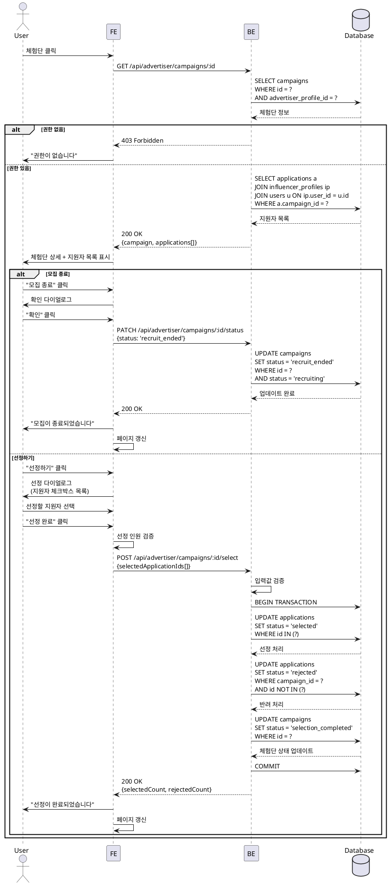

# UC-009: 광고주 체험단 상세 & 모집 관리

## Primary Actor
- 광고주 (체험단 소유자)

## Precondition
- 사용자가 로그인 상태
- 역할이 'advertiser'
- 조회하려는 체험단의 소유자
- 체험단이 존재함

## Trigger
- "체험단 관리" 목록에서 특정 체험단 클릭

## Main Scenario

1. 사용자가 체험단 클릭

2. 시스템이 체험단 상세 페이지 표시
   - 체험단 전체 정보
   - 현재 상태
   - 지원자 목록

3. 시스템이 지원자 테이블 렌더링
   - 인플루언서 정보 (이름, 채널)
   - 각오 한마디
   - 방문 예정일
   - 지원 일시
   - 지원 상태

4. 사용자가 상태별 필터 적용 (선택사항)

### 시나리오 A: 모집 종료

5A. 사용자가 "모집 종료" 버튼 클릭

6A. 시스템이 확인 다이얼로그 표시
   - "모집을 종료하시겠습니까?"

7A. 사용자가 "확인" 클릭

8A. 시스템이 campaigns.status를 'recruit_ended'로 업데이트

9A. 시스템이 성공 메시지 표시

10A. 시스템이 페이지 갱신
   - "모집 종료" 버튼 숨김
   - "선정하기" 버튼 활성화

### 시나리오 B: 체험단 선정

5B. 사용자가 "선정하기" 버튼 클릭

6B. 시스템이 선정 다이얼로그 표시
   - 지원자 목록 체크박스
   - 모집 인원 안내

7B. 사용자가 선정할 인플루언서 선택
   - 모집 인원만큼 선택

8B. 사용자가 "선정 완료" 버튼 클릭

9B. 시스템이 유효성 검증
   - 선정 인원 == 모집 인원 (또는 <= 모집 인원)

10B. 시스템이 선정 처리
   - 선정된 지원자: applications.status = 'selected'
   - 미선정 지원자: applications.status = 'rejected'
   - campaigns.status = 'selection_completed'

11B. 시스템이 성공 메시지 표시

12B. 시스템이 페이지 갱신

## Edge Cases

### 타인의 체험단 접근
- **발생**: 다른 광고주의 체험단 접근 시도
- **처리**: 403 Forbidden, "권한이 없습니다"

### 지원자 없이 모집 종료
- **발생**: 지원자가 0명인데 모집 종료 시도
- **처리**: 경고 메시지, "지원자가 없습니다. 그래도 종료하시겠습니까?"

### 선정 인원 불일치
- **발생**: 모집 인원보다 많이/적게 선택
- **처리**: "모집 인원은 {N}명입니다. {M}명을 선택했습니다" 에러 메시지

### 이미 모집 종료된 체험단
- **발생**: status = 'recruit_ended' 또는 'selection_completed'
- **처리**: "모집 종료" 버튼 숨김

### 이미 선정 완료된 체험단
- **발생**: status = 'selection_completed'
- **처리**: "선정하기" 버튼 숨김, 선정 결과만 표시

### 취소된 체험단
- **발생**: status = 'cancelled'
- **처리**: 모든 관리 버튼 숨김, "취소된 체험단입니다" 표시

### 동시성 문제
- **발생**: 여러 관리자가 동시에 선정 작업
- **처리**: 낙관적 락 또는 비관적 락, "이미 처리되었습니다" 에러

## Business Rules

### BR-001: 소유자만 관리 가능
- 체험단을 등록한 광고주만 해당 체험단 관리 가능

### BR-002: 상태 전환 순서
```
recruiting → recruit_ended → selection_completed
```
- 역순 전환 불가

### BR-003: 모집 종료 조건
- status = 'recruiting'일 때만 가능

### BR-004: 선정 조건
- status = 'recruit_ended'일 때만 가능

### BR-005: 선정 인원
- 선정 인원은 모집 인원 이하 (유연하게 적용 가능)

### BR-006: 지원자 상태 업데이트
- 선정 시 일괄 처리 (트랜잭션)
- 선정된 사람: 'selected'
- 나머지: 'rejected'

### BR-007: 취소 기능
- 모집 중에만 취소 가능 (선택적 구현)

## Sequence Diagram



## API Endpoints

### GET `/api/advertiser/campaigns/:id`
체험단 상세 및 지원자 목록 조회

### Response (200 OK)
```typescript
{
  campaign: {
    id: string;
    title: string;
    description: string;
    location: string;
    benefits: string;
    mission: string;
    recruitCount: number;
    recruitStartDate: string;
    recruitEndDate: string;
    experienceStartDate: string;
    experienceEndDate: string;
    status: 'recruiting' | 'recruit_ended' | 'selection_completed' | 'cancelled';
    createdAt: string;
  };
  applications: Array<{
    id: string;
    message: string;
    visitDate: string;
    status: 'submitted' | 'selected' | 'rejected';
    createdAt: string;
    influencer: {
      id: string;
      name: string;
      channelCount: number;
      channels: Array<{
        type: string;
        name: string;
        url: string;
      }>;
    };
  }>;
  stats: {
    totalApplications: number;
    submittedCount: number;
    selectedCount: number;
    rejectedCount: number;
  };
}
```

### PATCH `/api/advertiser/campaigns/:id/status`
모집 상태 변경

### Request Body
```typescript
{
  status: 'recruit_ended' | 'cancelled';
}
```

### Response (200 OK)
```typescript
{
  campaignId: string;
  status: string;
  updatedAt: string;
}
```

### POST `/api/advertiser/campaigns/:id/select`
지원자 선정

### Request Body
```typescript
{
  selectedApplicationIds: string[]; // 선정할 지원 ID 목록
}
```

### Response (200 OK)
```typescript
{
  campaignId: string;
  selectedCount: number;
  rejectedCount: number;
  status: 'selection_completed';
}
```

### Error Responses
- `400 Bad Request`: 유효성 검증 실패, 잘못된 상태 전환
- `403 Forbidden`: 권한 없음 (타인의 체험단)
- `404 Not Found`: 체험단 없음
- `409 Conflict`: 동시성 문제, 이미 처리됨
- `500 Internal Server Error`: 서버 오류

